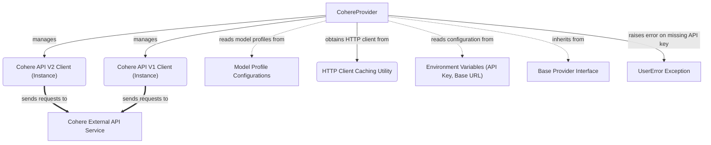

# cohere_provider

The `cohere_provider` module integrates the Cohere API into the `pydantic_ai_agent_core` system, enabling seamless interaction with Cohere's language models. It provides a standardized interface for accessing Cohere's model capabilities, managing API keys, and handling HTTP client configurations. This module is crucial for any agent or component within the system that needs to leverage Cohere's powerful AI models for tasks such as text generation, summarization, or embeddings.

The `CohereProvider` class acts as the primary interface, abstracting the complexities of direct API interaction and ensuring consistent model access. It manages both V1 and V2 Cohere API clients, offering flexibility for different model versions and capabilities.

<!-- DIAGRAM_JSON
{
    "direction": "TD",
    "nodes": [
        {
            "id": "cohere_provider_class",
            "label": "CohereProvider",
            "type": "component",
            "link": null
        },
        {
            "id": "cohere_v2_client_inst",
            "label": "Cohere API V2 Client (Instance)",
            "type": "component",
            "link": null
        },
        {
            "id": "cohere_v1_client_inst",
            "label": "Cohere API V1 Client (Instance)",
            "type": "component",
            "link": null
        },
        {
            "id": "cohere_external_api",
            "label": "Cohere External API Service",
            "type": "external",
            "link": null
        },
        {
            "id": "model_profile_definitions",
            "label": "Model Profile Configurations",
            "type": "external",
            "link": "model_profile_definitions.md"
        },
        {
            "id": "http_client_caching_util",
            "label": "HTTP Client Caching Utility",
            "type": "component",
            "link": null
        },
        {
            "id": "environment_variables",
            "label": "Environment Variables (API Key, Base URL)",
            "type": "external",
            "link": null
        },
        {
            "id": "base_provider_interface",
            "label": "Base Provider Interface",
            "type": "external",
            "link": "model_provider_integrations.md"
        },
        {
            "id": "user_error_exception",
            "label": "UserError Exception",
            "type": "external",
            "link": null
        }
    ],
    "edges": [
        {
            "source": "cohere_provider_class",
            "target": "base_provider_interface",
            "label": "inherits from"
        },
        {
            "source": "cohere_provider_class",
            "target": "cohere_v2_client_inst",
            "label": "manages"
        },
        {
            "source": "cohere_provider_class",
            "target": "cohere_v1_client_inst",
            "label": "manages"
        },
        {
            "source": "cohere_v2_client_inst",
            "target": "cohere_external_api",
            "label": "sends requests to"
        },
        {
            "source": "cohere_v1_client_inst",
            "target": "cohere_external_api",
            "label": "sends requests to"
        },
        {
            "source": "cohere_provider_class",
            "target": "model_profile_definitions",
            "label": "reads model profiles from"
        },
        {
            "source": "cohere_provider_class",
            "target": "environment_variables",
            "label": "reads configuration from"
        },
        {
            "source": "cohere_provider_class",
            "target": "http_client_caching_util",
            "label": "obtains HTTP client from"
        },
        {
            "source": "cohere_provider_class",
            "target": "user_error_exception",
            "label": "raises error on missing API key"
        }
    ],
    "groups": []
}
-->

## `CohereProvider` Class

The `CohereProvider` class is a specialized implementation of the `Provider` abstract base class, designed to facilitate interaction with the Cohere AI API. It encapsulates the logic for authenticating, configuring, and making requests to Cohere's language models.

### `__init__` Method

The constructor for `CohereProvider` allows for flexible initialization:

-   **`api_key`**: An optional string representing the Cohere API key. If not provided, the system attempts to retrieve it from the `CO_API_KEY` environment variable. A `UserError` is raised if no API key is found.
-   **`cohere_client`**: An optional, pre-initialized `AsyncClientV2` instance from the Cohere Python SDK. If this is provided, `api_key` and `http_client` must be `None`.
-   **`http_client`**: An optional, pre-initialized `httpx.AsyncClient` instance for making HTTP requests. This allows for custom HTTP client configurations, such as proxies or timeouts. If not provided, a cached HTTP client is used via an internal utility.

Upon initialization, the `CohereProvider` sets up both `AsyncClientV2` and `AsyncClient` instances to support both current and legacy Cohere API interactions.

### Properties

-   **`name`**: Returns the string `'cohere'`, identifying the provider.
-   **`base_url`**: Retrieves the base URL used by the Cohere client.
-   **`client`**: Provides access to the initialized `AsyncClientV2` instance, used for interacting with the latest Cohere API.
-   **`v1_client`**: Provides access to the initialized `AsyncClient` instance, used for interacting with older Cohere API versions. This can be `None` if not explicitly set up or if the older client is not supported in a given configuration.

### `model_profile` Static Method

The `model_profile` static method allows for retrieving specific model configurations for Cohere models. It takes a `model_name` as input and returns a `ModelProfile` object, which contains metadata and settings relevant to that particular Cohere model. This method delegates to an internal `cohere_model_profile` function to fetch the appropriate profile from the [Model Profile Configurations](model_profile_definitions.md).

## How it Connects

The `cohere_provider` module plays a vital role within the larger `pydantic_ai_agent_core` by providing concrete implementation for interacting with Cohere's models.

-   **Base Provider Interface**: `CohereProvider` inherits from a generic `Provider` interface, which is part of the [Model Provider Integrations](model_provider_integrations.md). This ensures that all AI model providers adhere to a consistent contract, making it easier to swap or integrate different models without altering core agent logic.
-   **Model Profile Configurations**: The `model_profile` method relies on the [Model Profile Configurations](model_profile_definitions.md) module to fetch specific settings for Cohere models. This separation of concerns allows for easy management and updates of model-specific parameters.
-   **HTTP Client Caching**: For efficient resource management, `CohereProvider` utilizes an internal HTTP client caching utility (`cached_async_http_client`) to reuse `httpx.AsyncClient` instances, reducing overhead for repeated API calls.
-   **Error Handling**: The module integrates with the system's `UserError` exception handling mechanism, ensuring that missing API keys or configuration issues are gracefully reported to the user.
