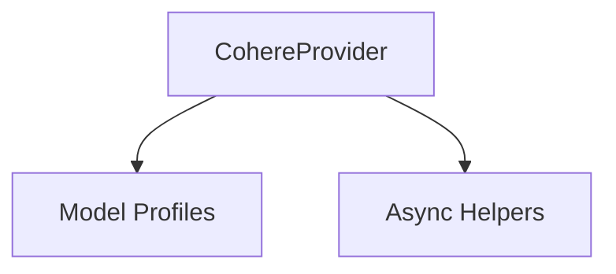

# cohere_provider

The `cohere_provider` module provides an interface for interacting with the Cohere API, enabling the use of Cohere models within the system. It handles authentication, client initialization, and exposes a consistent way to access Cohere's model capabilities.

## Architecture and Component Relationships

This module primarily exposes the `CohereProvider` class, which encapsulates the logic for configuring and managing the Cohere API client. It integrates with other modules for model profiling and HTTP client management.

<!-- DIAGRAM_JSON
{
    "direction": "TD",
    "nodes": [
        {"id": "cohere_provider_class", "label": "CohereProvider", "type": "component", "link": null},
        {"id": "model_profiles", "label": "Model Profiles", "type": "external", "link": "model_profiles.md"},
        {"id": "async_helpers", "label": "Async Helpers", "type": "external", "link": "async_helpers.md"}
    ],
    "edges": [
        {"source": "cohere_provider_class", "target": "model_profiles"},
        {"source": "cohere_provider_class", "target": "async_helpers"}
    ],
    "groups": []
}
-->

## Core Functionality

### `CohereProvider` Class

The `CohereProvider` class is the central component of this module, responsible for providing access to the Cohere API.

- **Purpose:** Manages the Cohere API client (`AsyncClientV2` and `AsyncClient`) and provides methods for interacting with Cohere models.
- **Initialization:**
    - Can be initialized with an `api_key` or an existing `cohere_client`.
    - If no `api_key` is provided, it attempts to read from the `CO_API_KEY` environment variable.
    - Utilizes `httpx.AsyncClient` for underlying HTTP requests, with an option to provide a custom client or use a cached one via `cached_async_http_client` (from [async_helpers](async_helpers.md)).
- **Properties:**
    - `name`: Returns 'cohere'.
    - `base_url`: Retrieves the base URL from the underlying Cohere client.
    - `client`: Returns the `AsyncClientV2` instance for Cohere API interactions.
    - `v1_client`: Returns the `AsyncClient` instance for Cohere V1 API interactions, if available.
- **Model Profiling:**
    - The `model_profile` static method delegates to `cohere_model_profile` (from [model_profiles](model_profiles.md)) to retrieve specific model configurations.

## How it Fits into the Overall System

The `cohere_provider` module acts as a concrete implementation of a language model provider, integrating Cohere's capabilities into the larger system. It allows other parts of the application, such as agent execution graphs or model abstractions, to seamlessly interact with Cohere models without needing to handle the low-level API details. It standardizes the interface for Cohere, making it interchangeable with other providers like OpenAI or Gemini.
