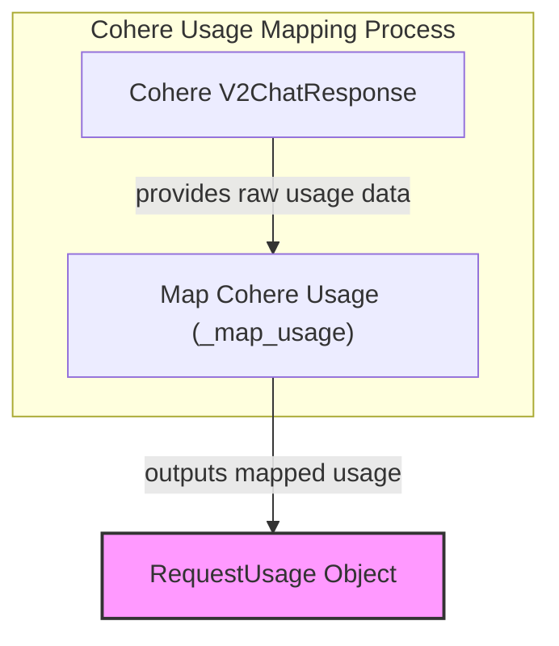

# Cohere Usage Mapper Module

The `cohere_usage_mapper` module is responsible for accurately mapping usage information from Cohere API responses into a standardized format used throughout the system. This is crucial for consistent cost tracking, monitoring, and reporting across different large language model providers.

## Core Functionality

The primary component of this module is the `_map_usage` function, which takes a `V2ChatResponse` object from the Cohere API and translates its billing and token usage details into the system's internal `RequestUsage` format.

### `_map_usage` Function

```python
def _map_usage(response: V2ChatResponse) -> usage.RequestUsage:
    u = response.usage
    if u is None:
        return usage.RequestUsage()
    else:
        details: dict[str, int] = {}
        if u.billed_units is not None:
            if u.billed_units.input_tokens:  # pragma: no branch
                details['input_tokens'] = int(u.billed_units.input_tokens)
            if u.billed_units.output_tokens:
                details['output_tokens'] = int(u.billed_units.output_tokens)
            if u.billed_units.search_units:  # pragma: no cover
                details['search_units'] = int(u.billed_units.search_units)
            if u.billed_units.classifications:  # pragma: no cover
                details['classifications'] = int(u.billed_units.classifications)

        request_tokens = int(u.tokens.input_tokens) if u.tokens and u.tokens.input_tokens else 0
        response_tokens = int(u.tokens.output_tokens) if u.tokens and u.tokens.output_tokens else 0
        return usage.RequestUsage(
            input_tokens=request_tokens,
            output_tokens=response_tokens,
            details=details,
        )
```

This function performs the following steps:

1.  **Extracts Usage Data**: It retrieves the `usage` object from the Cohere `V2ChatResponse`.
2.  **Handles Missing Data**: If no usage information is present, it returns an empty `RequestUsage` object.
3.  **Maps Billed Units**: It populates a `details` dictionary with billed input tokens, output tokens, search units, and classifications if they are available in the Cohere response.
4.  **Maps Token Counts**: It extracts the `input_tokens` and `output_tokens` from the Cohere response's `tokens` field.
5.  **Creates `RequestUsage`**: Finally, it constructs and returns a `RequestUsage` object, providing a normalized view of the Cohere API call's usage.

## System Integration

This module is a leaf module within the [model_provider_usage_mapping](model_provider_usage_mapping.md) subsystem, which centralizes the logic for mapping usage data from various model providers. It specifically handles usage mapping for the Cohere models. The `_map_usage` function depends on the [agent_utilities](agent_utilities.md) module for the `RequestUsage` data structure.

<!-- DIAGRAM_JSON
{
    "direction": "TD",
    "nodes": [
        {"id": "cohere_response", "label": "Cohere V2ChatResponse", "type": "component", "link": null},
        {"id": "map_usage_function", "label": "Map Cohere Usage (_map_usage)", "type": "component", "link": null},
        {"id": "request_usage", "label": "RequestUsage Object", "type": "external", "link": "agent_utilities.md"}
    ],
    "edges": [
        {"source": "cohere_response", "target": "map_usage_function", "label": "provides raw usage data"},
        {"source": "map_usage_function", "target": "request_usage", "label": "outputs mapped usage"}
    ],
    "groups": [
        {
            "id": "usage_mapping_process",
            "label": "Cohere Usage Mapping Process",
            "role": "analytical",
            "nodes": ["cohere_response", "map_usage_function"]
        }
    ]
}
-->


