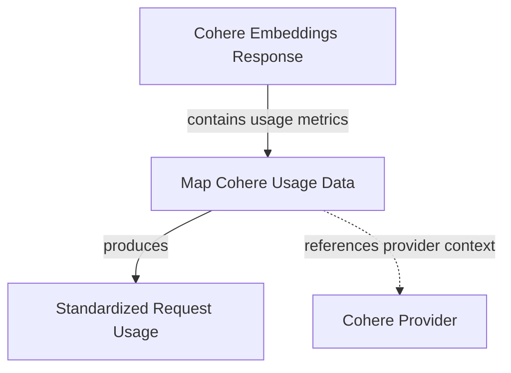

# Cohere Usage Mapping Module

The `cohere_usage_mapping` module is responsible for standardizing the usage data received from Cohere embedding API responses into a unified `RequestUsage` format. This standardization is crucial for consistent cost tracking, analytics, and reporting across different model providers within the system.

## How it Works

This module's primary function is to interpret the specific billing and usage metadata provided by Cohere's embedding API and transform it into a generic `RequestUsage` object. This involves extracting relevant metrics like billed units and input tokens, and enriching them with contextual information such as the provider name, URL, and the specific model used.

The `_map_usage` function serves as the core logic for this transformation. It takes a Cohere-specific embedding response, identifies the billed units within its metadata, and then constructs a `RequestUsage` instance. Any non-zero integer or float values in the `billed_units` are converted to integers and included in the final usage details. This ensures that only meaningful usage metrics are captured.

## Core Components

### `_map_usage`

-   **Path**: `pydantic_ai_slim/pydantic_ai/embeddings/cohere.py`
-   **Description**: This function takes a `EmbedByTypeResponse` object (Cohere's embedding response format), extracts billing information from its `meta.billed_units` field, and maps it to a `RequestUsage` object. It filters for positive integer or float values, converting them to integers, and includes provider-specific details.

## Connections to Other Modules

This module plays a vital role in the `embedding_provider_integrations` ecosystem by providing a consistent interface for Cohere embedding usage data.

-   **[Usage Module](usage.md)**: The `cohere_usage_mapping` module directly produces instances of `RequestUsage`, which is defined in the `usage` module. This provides a unified structure for tracking resource consumption across all integrated AI models and embedding providers.
-   **[Cohere Provider Module](cohere_provider.md)**: The input `EmbedByTypeResponse` originates from interactions with the Cohere API, typically managed by the `CohereProvider`. This module thus acts as a bridge between the raw Cohere response format and the system's internal usage tracking.

<!-- DIAGRAM_JSON
{
    "direction": "TD",
    "nodes": [
        {"id": "map_cohere_usage", "label": "Map Cohere Usage Data", "type": "component", "link": null},
        {"id": "cohere_embed_response", "label": "Cohere Embeddings Response", "type": "external", "link": null},
        {"id": "request_usage", "label": "Standardized Request Usage", "type": "external", "link": "usage.md"},
        {"id": "cohere_provider", "label": "Cohere Provider", "type": "external", "link": "cohere_provider.md"}
    ],
    "edges": [
        {"source": "cohere_embed_response", "target": "map_cohere_usage", "label": "contains usage metrics"},
        {"source": "map_cohere_usage", "target": "request_usage", "label": "produces"},
        {"source": "map_cohere_usage", "target": "cohere_provider", "label": "references provider context", "type": "dotted"}
    ],
    "groups": []
}
-->

