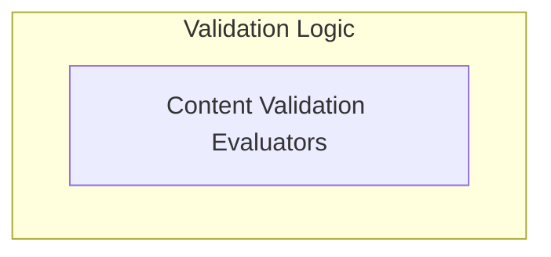

# Common Content Checks Module

The `common_content_checks` module provides a set of fundamental evaluators used within the `pydantic_evals` framework to perform basic yet crucial checks on various types of content. These checks ensure that outputs meet specific criteria, such as containing certain values or being instances of expected types. This module is essential for building robust evaluation pipelines, allowing developers to quickly ascertain the validity and structure of data.

## Architecture

The `common_content_checks` module is composed of a single sub-module: `content_evaluators`, which encapsulates the core logic for performing content and type-based validations.

<!-- DIAGRAM_JSON
{
    "direction": "TD",
    "nodes": [
        {
            "id": "common_content_checks",
            "label": "Common Content Checks",
            "type": "module"
        },
        {
            "id": "content_evaluators",
            "label": "Content Validation Evaluators",
            "type": "module",
            "link": "content_evaluators.md"
        }
    ],
    "edges": [],
    "groups": [
        {
            "id": "validation_logic",
            "label": "Validation Logic",
            "role": "analytical",
            "nodes": [
                "content_evaluators"
            ]
        }
    ]
}
-->

## Sub-modules

### [Content Validation Evaluators](content_evaluators.md)

This sub-module contains the primary evaluators responsible for performing common checks, such as verifying the presence of specific content within an output or validating its type. It handles various data structures and offers configurable options for precise validation.