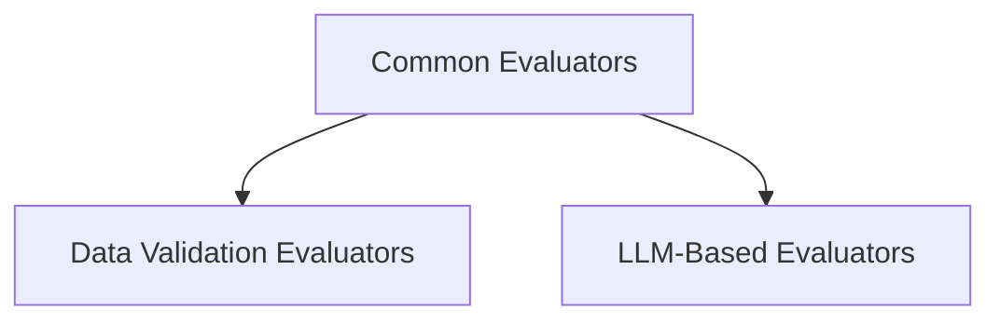

# Common Evaluators Module

## Introduction

The `common_evaluators` module provides a set of frequently used evaluators within the `pydantic_evals` framework. These evaluators are designed to assess model outputs against various criteria, ranging from basic data validation to more complex, LLM-based qualitative judgments. This module is a foundational part of the evaluation toolkit, enabling developers to quickly implement common assessment patterns.

## Architecture Overview

The `common_evaluators` module is structured into distinct sub-modules, each focusing on a specific type of evaluation. This separation ensures clarity and reusability of evaluation logic. The module integrates with the broader `pydantic_evals` framework, utilizing its `Evaluator` base classes and context management.

<!-- DIAGRAM_JSON
{
    "direction": "TD",
    "nodes": [
        {"id": "data_validation_evaluators", "label": "Data Validation Evaluators", "type": "module", "link": "data_validation_evaluators.md"},
        {"id": "llm_based_evaluators", "label": "LLM-Based Evaluators", "type": "module", "link": "llm_based_evaluators.md"}
    ],
    "edges": [
        {"source": "common_evaluators", "target": "data_validation_evaluators"},
        {"source": "common_evaluators", "target": "llm_based_evaluators"}
    ],
    "groups": []
}
-->

## Sub-modules

### Data Validation Evaluators
This sub-module ([`data_validation_evaluators.md`](data_validation_evaluators.md)) includes evaluators like `Contains` and `IsInstance`, which are used for basic checks such as verifying if an output contains a specific value or is of a certain type.

### LLM-Based Evaluators
This sub-module ([`llm_based_evaluators.md`](llm_based_evaluators.md)) provides advanced evaluators like `LLMJudge`, which leverages large language models to perform more nuanced and qualitative assessments of outputs against a defined rubric.
