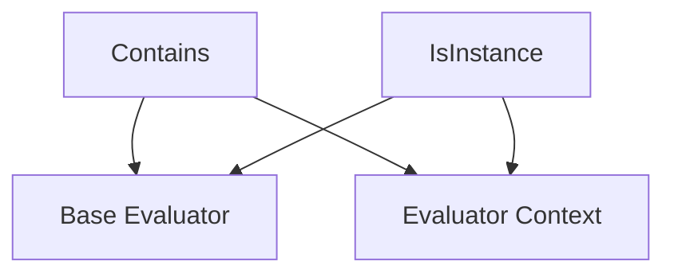

# common_validation_checks

The `common_validation_checks` module provides fundamental and reusable evaluators for validating output against expected values or types. It offers basic, yet powerful, checks like verifying content containment and type instances, forming a core part of the `pydantic_evals` framework's data validation capabilities.

## Architecture

<!-- DIAGRAM_JSON
{
    "direction": "TD",
    "nodes": [
        {"id": "contains_evaluator", "label": "Contains", "type": "component", "link": null},
        {"id": "is_instance_evaluator", "label": "IsInstance", "type": "component", "link": null},
        {"id": "evaluator_base", "label": "Base Evaluator", "type": "external", "link": "base_evaluator_framework.md"},
        {"id": "evaluator_context", "label": "Evaluator Context", "type": "external", "link": "pydantic_evals_core.md"}
    ],
    "edges": [
        {"source": "contains_evaluator", "target": "evaluator_base"},
        {"source": "is_instance_evaluator", "target": "evaluator_base"},
        {"source": "contains_evaluator", "target": "evaluator_context"},
        {"source": "is_instance_evaluator", "target": "evaluator_context"}
    ],
    "groups": []
}
-->

## Module Components

This module defines two primary evaluators: `Contains` and `IsInstance`. Both inherit from the `Evaluator` abstract base class, integrating seamlessly into the evaluation pipeline.

### Contains

The `Contains` evaluator is a versatile tool for checking if an output value includes or contains an expected value. Its behavior adapts based on the data types involved:

*   **Strings:** Checks if the `expected_output` is a substring of the `output`. Supports case-insensitive matching.
*   **Lists/Tuples:** Verifies if the `expected_output` is present as an element within the `output` collection.
*   **Dictionaries:** Ensures that all key-value pairs specified in `expected_output` are present and match in the `output` dictionary.
*   **Model-like Types (Pydantic `BaseModel`, dataclasses):** Automatically converts the model instance to a dictionary and performs key-value pair comparison similar to dictionaries.

#### Configuration Parameters:

*   `value (Any)`: The expected value to check for containment.
*   `case_sensitive (bool)`: If `True` (default), string comparisons are case-sensitive. Only applies when both `value` and `output` are strings.
*   `as_strings (bool)`: If `True`, both the output and the expected value are converted to strings before performing the containment check. This is automatically set to `True` if both `value` and `output` are strings.
*   `evaluation_name (str | None)`: An optional name for the evaluation.

#### Evaluation Logic:

The `evaluate` method attempts to perform the containment check based on the type of `ctx.output`. If `as_strings` is `True`, it converts both values to strings and checks for substring presence. For dictionary or model-like types, it iterates through the expected key-value pairs, ensuring their presence and equality in the output. If the check fails for any reason (including `TypeError` or `ValueError` during complex comparisons), a descriptive `EvaluationReason` is returned.

### IsInstance

The `IsInstance` evaluator is used to determine if an output value is an instance of a specific type identified by its name. This is particularly useful for verifying the structural integrity or expected data contract of evaluation results without needing direct access to the type itself.

#### Configuration Parameters:

*   `type_name (str)`: The name of the type (e.g., `str`, `int`, `MyCustomClass`) to check against. This can be the class name (`__name__`) or the fully qualified name (`__qualname__`).
*   `evaluation_name (str | None)`: An optional name for the evaluation.

#### Evaluation Logic:

The `evaluate` method inspects the Method Resolution Order (MRO) of the `ctx.output`'s type. It returns `True` if any class in the MRO matches the provided `type_name` (either by `__name__` or `__qualname__`). If no match is found, it returns `False` along with a reason indicating the actual type of the output.

## Relationships to Other Modules

*   **[Base Evaluator Framework](base_evaluator_framework.md)**: Both `Contains` and `IsInstance` inherit from `Evaluator`, which is defined in the base evaluator framework. This integration allows them to be used within the broader `pydantic_evals` evaluation system.
*   **[Pydantic AI Core Utilities](pydantic_ai_core.md)**: The `Contains` evaluator utilizes Pydantic's `TypeAdapter` and `is_model_like` utilities (implicitly through the `common` module's dependencies, though not directly imported in the snippet) for handling model-like types, highlighting a dependency on the underlying Pydantic framework for flexible data handling.
*   **[Pydantic Evals Core](pydantic_evals_core.md)**: These evaluators operate within the context provided by `EvaluatorContext`, which is part of the core evaluation runner logic.
