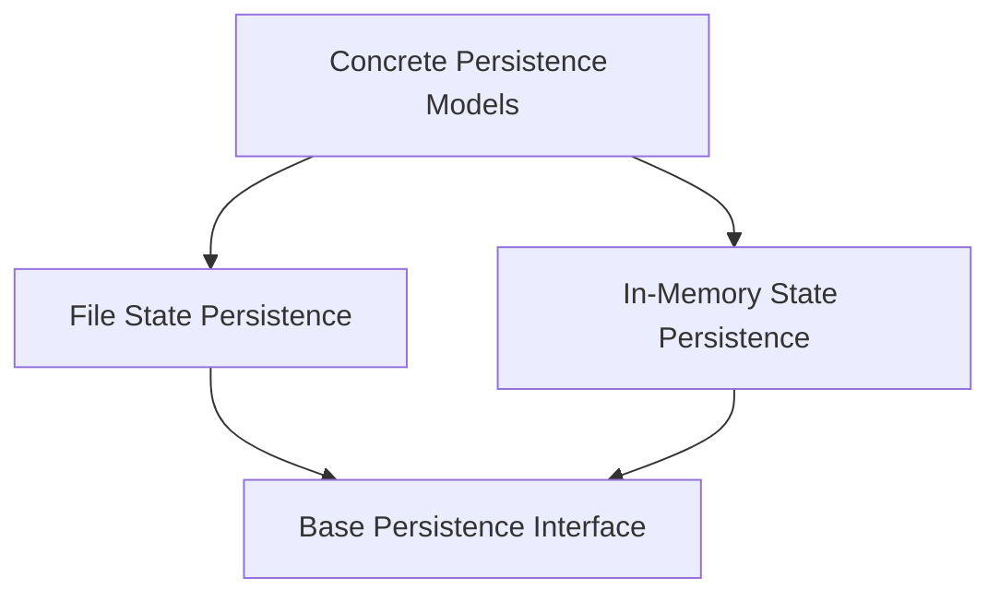

# Concrete Persistence Models

The `concrete_persistence_models` module provides concrete implementations for persisting the state of graph runs. These implementations manage how snapshots of the graph's state and execution results are stored, allowing for recovery, debugging, and review of graph execution.

## Architecture

This module contains two primary concrete persistence strategies: file-based persistence and in-memory persistence. Both implementations adhere to the `BaseStatePersistence` interface, defined in the [base_persistence_interface.md](base_persistence_interface.md) module, ensuring a consistent contract for state management.

-   **FileStatePersistence**: Stores graph run snapshots in a JSON file, providing durability across application restarts. It includes mechanisms for locking to ensure data integrity during concurrent access.
-   **FullStatePersistence**: Maintains graph run snapshots in memory, offering fast access and suitable for short-lived or testing scenarios. It supports deep copying of state to prevent unintended modifications to historical data.

These concrete models are crucial for enabling robust and observable graph execution within the `pydantic-graph` framework.

<!-- DIAGRAM_JSON
{
    "direction": "TD",
    "nodes": [
        {"id": "concrete_persistence_models", "label": "Concrete Persistence Models", "type": "module", "link": "concrete_persistence_models.md"},
        {"id": "file_state_persistence", "label": "File State Persistence", "type": "module", "link": "file_state_persistence.md"},
        {"id": "in_memory_state_persistence", "label": "In-Memory State Persistence", "type": "module", "link": "in_memory_state_persistence.md"},
        {"id": "base_persistence_interface", "label": "Base Persistence Interface", "type": "module", "link": "base_persistence_interface.md"}
    ],
    "edges": [
        {"source": "file_state_persistence", "target": "base_persistence_interface"},
        {"source": "in_memory_state_persistence", "target": "base_persistence_interface"},
        {"source": "concrete_persistence_models", "target": "file_state_persistence"},
        {"source": "concrete_persistence_models", "target": "in_memory_state_persistence"}
    ],
    "groups": []
}
-->

## Sub-modules

### [File State Persistence](file_state_persistence.md)
This sub-module focuses on the `FileStatePersistence` component, which handles the saving and loading of graph run snapshots to and from a JSON file. It provides methods for creating, updating, and retrieving snapshots, along with a robust locking mechanism to prevent race conditions during file access.

### [In-Memory State Persistence](in_memory_state_persistence.md)
This sub-module contains the `FullStatePersistence` component, an in-memory solution for storing graph run snapshots. It is designed for scenarios where disk I/O is not desired or for temporary graph runs. It includes functionality to deep copy state to ensure immutability of historical snapshots.
