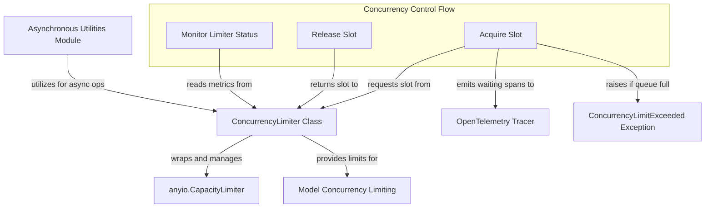

# Concurrency Management Module

The `concurrency_management` module provides robust mechanisms for controlling the number of simultaneous operations within the system. Its core component, `ConcurrencyLimiter`, is essential for preventing resource exhaustion, ensuring system stability under heavy load, and offering valuable observability into waiting and running tasks.

This module is particularly crucial in AI agents and model interactions, where multiple requests or tool calls might run concurrently. By managing concurrency, the system can gracefully handle peak loads and provide insights into bottlenecks.

## Core Component: ConcurrencyLimiter

The `ConcurrencyLimiter` class is a high-level concurrency control mechanism built upon `anyio`'s `CapacityLimiter`. It enhances basic capacity limiting with features specifically designed for observability and queue management.

### Functionality

*   **Limit Concurrent Operations**: Defines a `max_running` limit, ensuring that no more than a specified number of operations execute simultaneously.
*   **Queue Management**: Optionally defines a `max_queued` limit, which prevents an unbounded queue of waiting operations. If the queue depth exceeds `max_queued`, a `ConcurrencyLimitExceeded` exception is raised, preventing the system from being overwhelmed.
*   **Observability**: Integrates with OpenTelemetry to create spans when an operation has to wait for an available slot. This provides critical visibility into where time is spent waiting for resources within asynchronous workflows.
*   **Dynamic Configuration**: Can be initialized directly with `max_running` and `max_queued`, or configured from a `ConcurrencyLimit` object (if a more complex configuration is needed, though `ConcurrencyLimit` itself is not defined in this module).
*   **Metrics**: Provides properties (`waiting_count`, `running_count`, `available_count`, `max_running`) to programmatically monitor the current state of the limiter.

### How It Works

1.  **Initialization**: A `ConcurrencyLimiter` is created with a `max_running` value and optional `max_queued`, `name`, and an OpenTelemetry `tracer`.
2.  **Acquiring a Slot**: When an operation needs to run, it calls `acquire(source)`.
    *   It first attempts to acquire a slot immediately.
    *   If no slot is available, it checks if the `max_queued` limit has been reached. If so, it raises `ConcurrencyLimitExceeded`.
    *   The operation then registers itself as 'waiting' and creates an OpenTelemetry span before blocking until a slot becomes available.
3.  **Releasing a Slot**: Once an operation completes (successfully or with an error), it calls `release()`, making its slot available for other waiting operations.

## Architecture Diagram

<!-- DIAGRAM_JSON
{
    "direction": "TD",
    "nodes": [
        {"id": "concurrency_limiter_class", "label": "ConcurrencyLimiter Class", "type": "component", "link": null},
        {"id": "acquire_method", "label": "Acquire Slot", "type": "component", "link": null},
        {"id": "release_method", "label": "Release Slot", "type": "component", "link": null},
        {"id": "monitor_status", "label": "Monitor Limiter Status", "type": "component", "link": null},
        {"id": "anyio_capacity_limiter", "label": "anyio.CapacityLimiter", "type": "external", "link": null},
        {"id": "opentelemetry_tracer", "label": "OpenTelemetry Tracer", "type": "external", "link": null},
        {"id": "concurrency_limit_exceeded", "label": "ConcurrencyLimitExceeded Exception", "type": "external", "link": "exceptions.md"},
        {"id": "asynchronous_utilities", "label": "Asynchronous Utilities Module", "type": "external", "link": "asynchronous_utilities.md"},
        {"id": "model_concurrency_limiting", "label": "Model Concurrency Limiting", "type": "external", "link": "model_utilities.md"}
    ],
    "edges": [
        {"source": "concurrency_limiter_class", "target": "anyio_capacity_limiter", "label": "wraps and manages"},
        {"source": "acquire_method", "target": "concurrency_limiter_class", "label": "requests slot from"},
        {"source": "release_method", "target": "concurrency_limiter_class", "label": "returns slot to"},
        {"source": "monitor_status", "target": "concurrency_limiter_class", "label": "reads metrics from"},
        {"source": "acquire_method", "target": "opentelemetry_tracer", "label": "emits waiting spans to"},
        {"source": "acquire_method", "target": "concurrency_limit_exceeded", "label": "raises if queue full"},
        {"source": "asynchronous_utilities", "target": "concurrency_limiter_class", "label": "utilizes for async ops"},
        {"source": "concurrency_limiter_class", "target": "model_concurrency_limiting", "label": "provides limits for"}
    ],
    "groups": [
        {
            "id": "concurrency_flow",
            "label": "Concurrency Control Flow",
            "role": "control",
            "nodes": ["acquire_method", "release_method", "monitor_status"]
        }
    ]
}
-->
```
