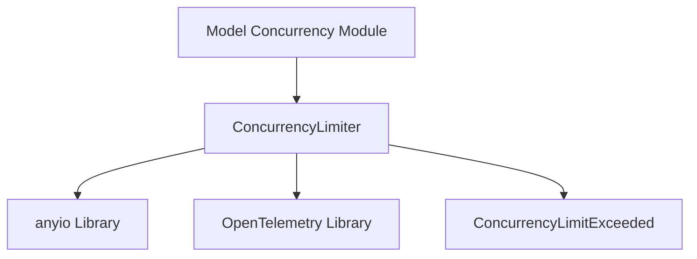

# Concurrency Management Module

## Introduction

The `concurrency_management` module is a critical component within the `pydantic_ai_slim` framework, primarily responsible for controlling the number of concurrent operations to prevent resource exhaustion and ensure stable system performance. It provides robust mechanisms for limiting ongoing tasks, queueing waiting operations, and offering observability into concurrency patterns.

## Core Functionality

This module's core functionality revolves around the `ConcurrencyLimiter` class, which acts as a sophisticated wrapper around `anyio.CapacityLimiter`.

### `ConcurrencyLimiter`

The `ConcurrencyLimiter` class provides the following key features:

*   **Concurrency Control**: Limits the maximum number of operations that can run simultaneously (`max_running`).
*   **Queue Management**: Optionally limits the number of operations that can be queued while waiting for an available slot (`max_queued`). If this limit is exceeded, a `ConcurrencyLimitExceeded` exception is raised.
*   **Observability**: Integrates with OpenTelemetry to create spans when operations are forced to wait, providing insights into potential bottlenecks and performance characteristics.
*   **Dynamic Initialization**: Can be initialized directly with `max_running` and `max_queued` or via a `ConcurrencyLimit` configuration object using the `from_limit` class method.
*   **Status Reporting**: Provides properties to query the current state, such as `waiting_count`, `running_count`, `available_count`, and `max_running`.

**Key Methods and Properties:**

*   `__init__(max_running, *, max_queued=None, name=None, tracer=None)`: Initializes the limiter with concurrency and queue limits, an optional name for identification, and an OpenTelemetry tracer.
*   `from_limit(limit, *, name=None, tracer=None)`: A class method to create a `ConcurrencyLimiter` instance from either an integer (for `max_running`) or a `ConcurrencyLimit` object.
*   `acquire(source)`: Attempts to acquire a concurrency slot. If no slot is immediately available, it increments the `waiting_count`, creates an OpenTelemetry span to track the waiting period, and blocks until a slot becomes free. If `max_queued` is set and exceeded, it raises `ConcurrencyLimitExceeded`.
*   `release()`: Releases an acquired slot, making it available for other operations.
*   `name`: (Property) The optional name given to the limiter.
*   `waiting_count`: (Property) The current number of operations waiting to acquire a slot.
*   `running_count`: (Property) The current number of operations actively using a slot.
*   `available_count`: (Property) The number of slots currently available.
*   `max_running`: (Property) The total number of concurrent operations allowed.

## Architecture and Component Relationships

The `ConcurrencyLimiter` internally leverages `anyio.CapacityLimiter` for the fundamental concurrency control and `anyio.Lock` to safely manage the `_waiting_count` and enforce `max_queued` limits in an asynchronous environment. It also interacts with the OpenTelemetry tracing system to provide detailed observability into operations that contend for resources.

<!-- DIAGRAM_JSON
{
    "direction": "TD",
    "nodes": [
        {"id": "concurrency_limiter", "label": "ConcurrencyLimiter", "type": "component", "link": null},
        {"id": "anyio_lib", "label": "anyio Library", "type": "external", "link": null},
        {"id": "opentelemetry_lib", "label": "OpenTelemetry Library", "type": "external", "link": null},
        {"id": "concurrency_limit_exceeded", "label": "ConcurrencyLimitExceeded", "type": "external", "link": "pydantic_ai_core.md"},
        {"id": "model_concurrency_module", "label": "Model Concurrency Module", "type": "external", "link": "model_concurrency.md"}
    ],
    "edges": [
        {"source": "concurrency_limiter", "target": "anyio_lib"},
        {"source": "concurrency_limiter", "target": "opentelemetry_lib"},
        {"source": "concurrency_limiter", "target": "concurrency_limit_exceeded"},
        {"source": "model_concurrency_module", "target": "concurrency_limiter"}
    ],
    "groups": []
}
-->

## How the Module Fits into the Overall System

The `concurrency_management` module provides a foundational utility for resource governance across the `pydantic_ai_slim` ecosystem. Its `ConcurrencyLimiter` is designed to be integrated wherever asynchronous operations need to be controlled to prevent overload, particularly in scenarios involving external API calls or resource-intensive tasks.

A prime example of its integration is within the [Model Concurrency Module](model_concurrency.md), where it is used to limit the number of simultaneous requests to large language models (LLMs) or other AI services. By centralizing concurrency logic, this module ensures consistent behavior, simplifies resource management, and enhances the reliability and performance of AI agents and applications built with `pydantic_ai_slim`.