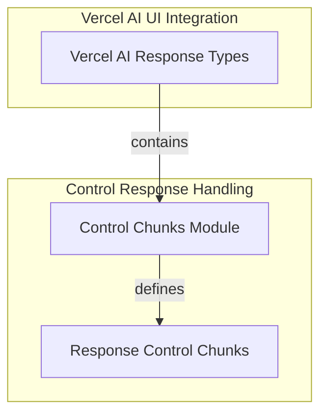

# Control Chunks Module Documentation

## Introduction

The `control_chunks` module is a vital part of the Pydantic AI's UI integration with Vercel AI. It defines the structured response types that control the flow and provide essential metadata within a streaming AI conversation. These chunks allow the frontend to gracefully handle events such as an agent aborting its operation or receiving critical information about the ongoing message.

## Architecture Overview

This module is situated within the `vercel_ai_response_types` module, which is part of the broader `ui_vercel_ai_adapter`. It specifically focuses on the "control" aspects of the Vercel AI streaming response, working alongside other chunk types (like `dynamic_data_chunk` and `source_chunks`) to form a complete response mechanism.

<!-- DIAGRAM_JSON
{
    "direction": "TD",
    "nodes": [
        {
            "id": "vercel_ai_response_types",
            "label": "Vercel AI Response Types",
            "type": "module",
            "link": "vercel_ai_response_types.md"
        },
        {
            "id": "control_chunks",
            "label": "Control Chunks Module",
            "type": "module",
            "link": "control_chunks.md"
        },
        {
            "id": "response_control_chunks",
            "label": "Response Control Chunks",
            "type": "module",
            "link": "response_control_chunks.md"
        }
    ],
    "edges": [
        {
            "source": "vercel_ai_response_types",
            "target": "control_chunks",
            "label": "contains"
        },
        {
            "source": "control_chunks",
            "target": "response_control_chunks",
            "label": "defines"
        }
    ],
    "groups": [
        {
            "id": "vercel_ai_ui",
            "label": "Vercel AI UI Integration",
            "role": "surface",
            "nodes": [
                "vercel_ai_response_types"
            ]
        },
        {
            "id": "control_response_handling",
            "label": "Control Response Handling",
            "role": "generative",
            "nodes": [
                "control_chunks",
                "response_control_chunks"
            ]
        }
    ]
}
-->

## Sub-modules

### Response Control Chunks
This sub-module defines the data structures for managing control signals and embedding metadata within the AI's streamed output. It includes mechanisms for indicating an early termination of a response and for transmitting contextual information related to the current message. For more details, refer to [response_control_chunks.md](response_control_chunks.md).
