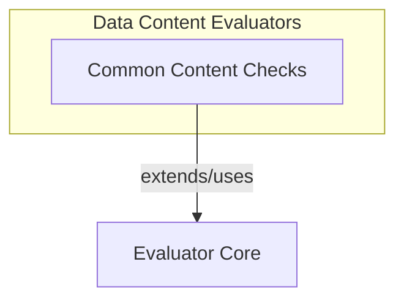

# Data Content Evaluators Module

The `data_content_evaluators` module provides a set of fundamental evaluators used within the [pydantic_evals_framework.md](pydantic_evals_framework.md) to perform basic content and type checks on various outputs. It is a critical part of the [standard_evaluators.md](standard_evaluators.md) suite, offering building blocks for assessing whether an output meets specific structural or content-based criteria.

This module is designed to be highly versatile, capable of checking strings, collections (lists, tuples, dictionaries), and Pydantic-like models for containment of values or adherence to specific types.

## Architecture

The `data_content_evaluators` module is designed to integrate seamlessly with the broader [evaluator_core.md](evaluator_core.md) of the evaluation framework. It encapsulates common evaluation logic, making it reusable and easy to understand.

<!-- DIAGRAM_JSON
{
    "direction": "TD",
    "nodes": [
        {"id": "evaluator_core", "label": "Evaluator Core (External)", "type": "external", "link": "evaluator_core.md"},
        {"id": "common_content_checks", "label": "Common Content Checks", "type": "module", "link": "common_content_checks.md"}
    ],
    "edges": [
        {"source": "common_content_checks", "target": "evaluator_core", "label": "extends/uses"}
    ],
    "groups": [
        {
            "id": "content_evaluation",
            "label": "Content Evaluation Logic",
            "role": "generative",
            "nodes": ["common_content_checks"]
        },
        {
            "id": "framework",
            "label": "Evaluation Framework",
            "role": "analytical",
            "nodes": ["evaluator_core"]
        }
    ]
}
-->

## Sub-modules

### [Common Content Checks](common_content_checks.md)
This sub-module provides fundamental evaluators such as `Contains` for verifying content inclusion (e.g., substring, item in list, key-value pairs in dict) and `IsInstance` for checking if an output matches a specified type by name. These evaluators are essential for basic validation tasks within the evaluation framework.
