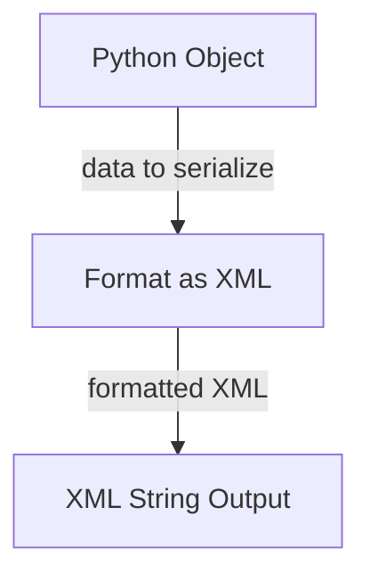

# Data Formatting Module

The `data_formatting` module provides utilities for converting Python objects into various structured data formats, primarily focusing on XML. This is particularly useful when interacting with Large Language Models (LLMs), as they often perform better when consuming semi-structured data like XML rather than other formats like JSON, especially for examples and complex structures.

## Core Components

### `format_as_xml`

The `format_as_xml` function is a versatile tool for serializing a wide range of Python objects into a well-formatted XML string. It handles various built-in types, as well as Pydantic models and dataclasses, making it highly adaptable for different data representation needs.

**Purpose:**
To convert Python data structures into an XML representation, facilitating easier parsing and understanding by LLMs due to XML's hierarchical and tag-based nature.

**Supported Types:**
`str`, `bytes`, `bytearray`, `bool`, `int`, `float`, `Decimal`, `date`, `datetime`, `time`, `timedelta`, `UUID`, `Enum`, `Mapping`, `Iterable`, `dataclass`, and `BaseModel`.

**Arguments:**

*   `obj`: The Python object to be serialized into XML.
*   `root_tag`: An optional string that specifies the outer tag to wrap the entire XML output. If `None`, no outer tag is used.
*   `item_tag`: The tag to be used for individual items within an iterable (e.g., list). This can be overridden by the class name for dataclasses and Pydantic models.
*   `none_str`: The string representation to use for `None` values within the XML output. Defaults to `'null'`.
*   `indent`: The string used for indentation when pretty-printing the XML. If `None`, no indentation is applied. Defaults to `'  '`.
*   `include_field_info`: A boolean or `'once'` literal indicating whether to include Pydantic `Field` attributes (e.g., `title`, `description`) or dataclass `field()` `metadata` as XML attributes. If `'once'`, these attributes are only included for the first occurrence of a field.

**Returns:**
A string containing the XML representation of the input Python object.

**Example:**

```python {title="format_as_xml_example.py" lint="skip"}
from pydantic_ai_slim.pydantic_ai.format_prompt import format_as_xml

print(format_as_xml({'name': 'John', 'height': 6, 'weight': 200}, root_tag='user'))
'''
<user>
  <name>John</name>
  <height>6</height>
  <weight>200</weight>
</user>
'''

from pydantic import BaseModel, Field

class Address(BaseModel):
    street: str = Field(description="Street name and number")
    city: str

class User(BaseModel):
    name: str = Field(title="User's Full Name")
    age: int
    address: Address

user_data = User(name="Alice", age=30, address=Address(street="123 Main St", city="Anytown"))
print(format_as_xml(user_data, root_tag='person', include_field_info='once'))
'''
<person>
  <name title="User's Full Name">Alice</name>
  <age>30</age>
  <address>
    <street description="Street name and number">123 Main St</street>
    <city>Anytown</city>
  </address>
</person>
'''
```

<!-- DIAGRAM_JSON
{
    "direction": "TD",
    "nodes": [
        {"id": "input_object", "label": "Python Object", "type": "component", "link": null},
        {"id": "format_as_xml", "label": "Format as XML", "type": "component", "link": null},
        {"id": "xml_output", "label": "XML String Output", "type": "component", "link": null}
    ],
    "edges": [
        {"source": "input_object", "target": "format_as_xml", "label": "data to serialize"},
        {"source": "format_as_xml", "target": "xml_output", "label": "formatted XML"}
    ]
}
-->

