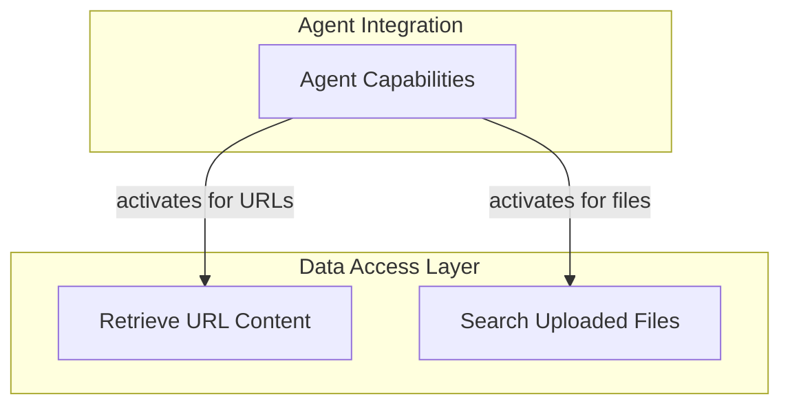

# Data Retrieval Tools

The `data_retrieval_tools` module provides built-in functionalities for agents to access and utilize external information. This module is crucial for enabling agents to interact with web content and private file stores, extending their knowledge base beyond their training data. It encapsulates tools for fetching data from URLs and performing vector-based searches on uploaded files, forming a core part of the agent's ability to perform Retrieval-Augmented Generation (RAG).

## Architecture Overview

This module integrates with the agent's core capabilities, allowing agents to seamlessly incorporate external data into their reasoning and response generation processes. It primarily consists of tools that bridge the agent to various data sources.

<!-- DIAGRAM_JSON
{
    "direction": "TD",
    "nodes": [
        {"id": "url_context_tool", "label": "Retrieve URL Content", "type": "module", "link": "url_context_tool.md"},
        {"id": "file_search_tool", "label": "Search Uploaded Files", "type": "module", "link": "file_search_tool.md"},
        {"id": "agent_capabilities", "label": "Agent Capabilities", "type": "external", "link": "capabilities_web_interaction.md"}
    ],
    "edges": [
        {"source": "agent_capabilities", "target": "url_context_tool", "label": "activates for URLs"},
        {"source": "agent_capabilities", "target": "file_search_tool", "label": "activates for files"}
    ],
    "groups": [
        {
            "id": "data_access",
            "label": "Data Access Layer",
            "role": "data",
            "nodes": ["url_context_tool", "file_search_tool"]
        },
        {
            "id": "integration",
            "label": "Agent Integration",
            "role": "analytical",
            "nodes": ["agent_capabilities"]
        }
    ]
}
-->

## Sub-modules

*   **[URL Context Retrieval](url_context_tool.md)**: Handles the retrieval of content from specified URLs.
*   **[File Search and RAG](file_search_tool.md)**: Provides tools for performing vector-based searches over uploaded documents and integrating results into agent responses.
