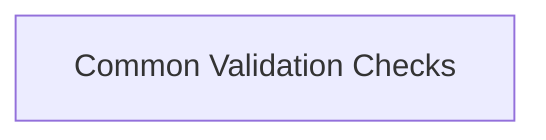

# Data Validation Evaluators Module

The `data_validation_evaluators` module provides essential tools for performing common data validation checks within the `pydantic_evals` framework. It includes evaluators to verify if an output contains a specific value or if it is an instance of a particular type. These evaluators are fundamental for building robust and reliable evaluation pipelines.

## Architecture Overview

The `data_validation_evaluators` module is a part of the `pydantic_evals_evaluators` module. It specifically focuses on basic yet powerful validation mechanisms that can be applied across various data types and structures.

<!-- DIAGRAM_JSON
{
    "direction": "TD",
    "nodes": [
        {"id": "common_validation_checks", "label": "Common Validation Checks", "type": "module", "link": "common_validation_checks.md"}
    ],
    "edges": [
    ],
    "groups": []
}
-->

## Sub-modules

### Common Validation Checks (`common_validation_checks`)

This sub-module encapsulates the core logic for common data validation operations. It provides evaluators like `Contains` for checking value containment and `IsInstance` for type verification. For more detailed information, refer to the [Common Validation Checks documentation](common_validation_checks.md).