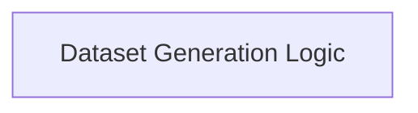

<!-- AUTO_GENERATED_PLACEHOLDER
  reason: LLM did not create .md file for this module
  module_path: pydantic_evals_framework/dataset_management/dataset_generation_logic
  component_count: 1
  generated_at: 2026-04-06T06:47:34.944779
  TODO: Fix LLM prompt to handle small leaf modules
-->

# Dataset Generation Logic

> ⚠️ **Auto-Generated Placeholder**
> This documentation was auto-generated because the LLM failed to create it.
> Module path: `pydantic_evals_framework/dataset_management/dataset_generation_logic`

Provides functionality to generate new datasets using Large Language Models (LLMs) based on defined schemas.

## Components

This module contains 1 component(s):

- `pydantic_evals.pydantic_evals.generation.generate_dataset`

## Structure

---
*Auto-generated placeholder. See sync_issues.json for details.*
