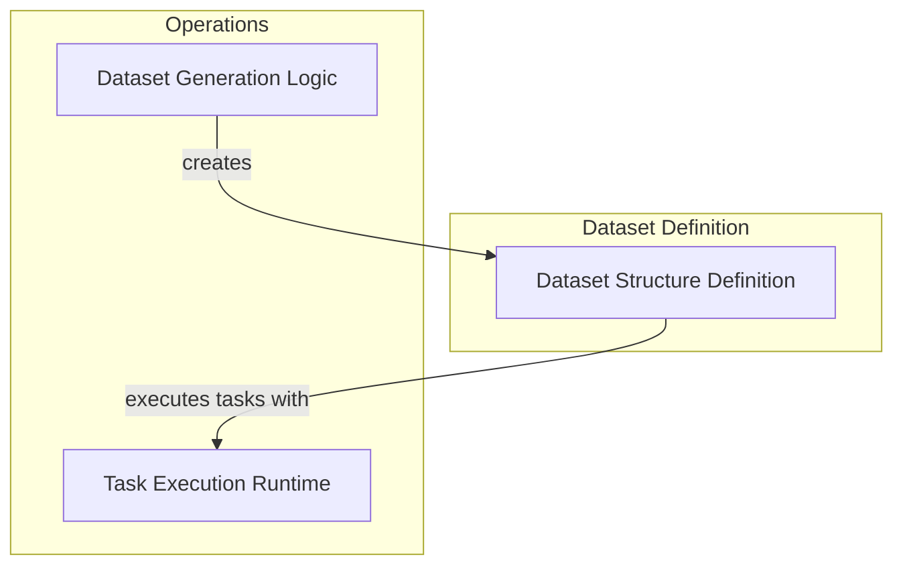

# Dataset Management Module Documentation

The `dataset_management` module is a crucial part of the Pydantic Evals framework, responsible for defining, generating, and managing datasets used in evaluating AI models. It provides structured ways to represent test cases, integrate evaluators, and leverage LLMs for automated dataset creation.

## Architecture Overview

The module is composed of three primary sub-modules: [Dataset Structure Definition](dataset_structure.md), [Dataset Generation Logic](dataset_generation_logic.md), and [Task Execution Runtime](task_execution_runtime.md). These sub-modules work in concert to allow users to define their dataset schema, generate synthetic data, and execute evaluation tasks efficiently.

<!-- DIAGRAM_JSON
{
    "direction": "TD",
    "nodes": [
        {"id": "dataset_structure", "label": "Dataset Structure Definition", "type": "module", "link": "dataset_structure.md"},
        {"id": "dataset_generation_logic", "label": "Dataset Generation Logic", "type": "module", "link": "dataset_generation_logic.md"},
        {"id": "task_execution_runtime", "label": "Task Execution Runtime", "type": "module", "link": "task_execution_runtime.md"}
    ],
    "edges": [
        {"source": "dataset_generation_logic", "target": "dataset_structure", "label": "creates"},
        {"source": "dataset_structure", "target": "task_execution_runtime", "label": "executes tasks with"}
    ],
    "groups": [
        {
            "id": "definition",
            "label": "Dataset Definition",
            "role": "data",
            "nodes": ["dataset_structure"]
        },
        {
            "id": "operations",
            "label": "Operations",
            "role": "generative",
            "nodes": ["dataset_generation_logic", "task_execution_runtime"]
        }
    ]
}
-->

## High-Level Functionality of Each Sub-module

*   **[Dataset Structure Definition](dataset_structure.md)**: This sub-module focuses on the `Dataset` Pydantic model, which serves as the blueprint for all evaluation datasets. It encapsulates test cases, input/output types, and integrates evaluator definitions, providing a robust and type-safe way to define evaluation criteria.

*   **[Dataset Generation Logic](dataset_generation_logic.md)**: This sub-module leverages Large Language Models (LLMs) to automatically generate diverse and structured test cases for a given dataset schema. It simplifies the process of populating datasets with realistic examples, significantly reducing manual effort in creating evaluation data.

*   **[Task Execution Runtime](task_execution_runtime.md)**: This sub-module provides the foundational runtime for executing individual evaluation tasks within a dataset. It handles the asynchronous execution of tasks, ensuring proper context management, performance tracking, and error handling during the evaluation process.
