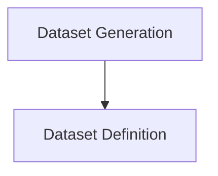

# Dataset Management Module

The `dataset_management` module is responsible for defining, creating, and managing datasets used in evaluation processes within the `pydantic_evals` framework. It provides functionalities to structure evaluation cases and to leverage Large Language Models (LLMs) for generating synthetic datasets.

## Architecture Overview

This module is composed of two primary sub-modules: `dataset_definition` and `dataset_generation`. The `dataset_definition` sub-module establishes the fundamental structure for datasets, including how test cases and evaluators are represented. Building upon this, the `dataset_generation` sub-module uses LLMs to populate these defined dataset structures with generated content.

<!-- DIAGRAM_JSON
{
    "direction": "TD",
    "nodes": [
        {"id": "dataset_definition", "label": "Dataset Definition", "type": "module", "link": "dataset_definition.md"},
        {"id": "dataset_generation", "label": "Dataset Generation", "type": "module", "link": "dataset_generation.md"}
    ],
    "edges": [
        {"source": "dataset_generation", "target": "dataset_definition"}
    ],
    "groups": []
}
-->

## Sub-modules

### [Dataset Definition](dataset_definition.md)
This sub-module focuses on the programmatic definition of datasets, including the schema for input, output, metadata, and associated evaluators. It provides the `Dataset` class, which serves as the blueprint for all evaluation datasets.

### [Dataset Generation](dataset_generation.md)
This sub-module provides tools for automatically generating synthetic datasets. It leverages LLMs to create test cases that conform to a specified `Dataset` schema, facilitating the rapid creation of evaluation data.