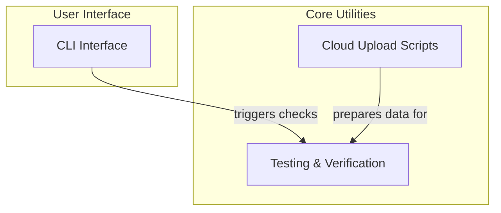

# Developer Utility Scripts Module

## Introduction

The `developer_utility_scripts` module provides a collection of standalone scripts designed to assist developers with various tasks, including command-line interface execution, testing infrastructure verification, and cloud-specific file management. These utilities streamline development workflows, ensure the integrity of test data, and facilitate interactions with external cloud services.

## Architecture Overview

The module is structured into three primary sub-modules, each focusing on a distinct area of developer assistance. These sub-modules work independently but collectively support the broader development and testing ecosystem.

<!-- DIAGRAM_JSON
{
    "direction": "TD",
    "nodes": [
        {
            "id": "developer_utility_scripts",
            "label": "Developer Utility Scripts",
            "type": "module"
        },
        {
            "id": "cli_interface",
            "label": "CLI Interface",
            "type": "module",
            "link": "cli_interface.md"
        },
        {
            "id": "testing_and_verification",
            "label": "Testing & Verification",
            "type": "module",
            "link": "testing_and_verification.md"
        },
        {
            "id": "cloud_upload_scripts",
            "label": "Cloud Upload Scripts",
            "type": "module",
            "link": "cloud_upload_scripts.md"
        }
    ],
    "edges": [
        {
            "source": "cli_interface",
            "target": "testing_and_verification",
            "label": "triggers checks"
        },
        {
            "source": "cloud_upload_scripts",
            "target": "testing_and_verification",
            "label": "prepares data for"
        }
    ],
    "groups": [
        {
            "id": "interface",
            "label": "User Interface",
            "role": "surface",
            "nodes": [
                "cli_interface"
            ]
        },
        {
            "id": "utilities",
            "label": "Core Utilities",
            "role": "analytical",
            "nodes": [
                "testing_and_verification",
                "cloud_upload_scripts"
            ]
        }
    ]
}
-->

## Sub-modules

### [CLI Interface](cli_interface.md)
This sub-module provides the command-line interface entry point for the `clai` utility. It handles the initial invocation and exit process for the CLI tool.

### [Testing and Verification](testing_and_verification.md)
This sub-module contains scripts essential for validating the testing infrastructure. It includes tools for checking VCR cassettes to identify orphaned recordings and scripts for verifying Google Cloud Storage (GCS) integrations with Vertex AI, ensuring data accessibility and correctness for various file types.

### [Cloud Upload Scripts](cloud_upload_scripts.md)
This sub-module comprises utility scripts designed for uploading test files to a variety of cloud providers, including OpenAI, Anthropic, XAI, Google, Google Vertex, and Bedrock. It automates the process of preparing and transferring necessary test data to respective cloud environments.