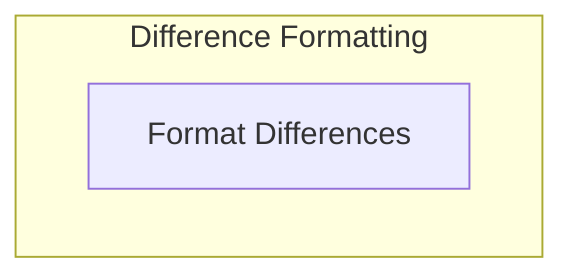

# Diff Formatters Module

The `diff_formatters` module is a crucial part of the `pydantic_evals_framework`'s reporting and rendering capabilities. It provides specialized functions for elegantly formatting and presenting numerical and duration differences between two values. This module ensures that users and developers can easily understand the magnitude and direction of changes in evaluation metrics, making reports more readable and insightful.

## Architecture

The `diff_formatters` module is currently composed of a single sub-module: `diff_rendering`, which encapsulates the logic for various difference formatting scenarios.

<!-- DIAGRAM_JSON
{
    "direction": "TD",
    "nodes": [
        {"id": "diff_rendering", "label": "Format Differences", "type": "module", "link": "diff_rendering.md"}
    ],
    "edges": [],
    "groups": [
        {
            "id": "formatters",
            "label": "Difference Formatting",
            "role": "analytical",
            "nodes": ["diff_rendering"]
        }
    ]
}
-->

## Sub-modules

### [Difference Rendering](diff_rendering.md)
The `diff_rendering` sub-module provides core utilities for converting raw numerical and duration differences into human-readable string representations. It handles various formatting rules, including absolute differences, percentage changes, and multipliers, ensuring clear communication of evaluation results.
