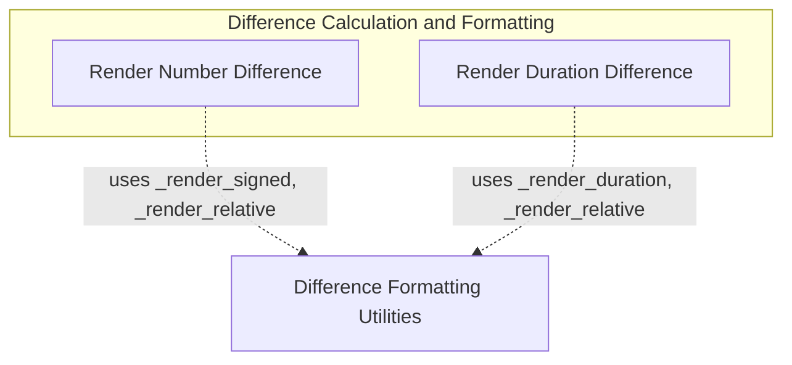

# Module: diff_rendering

The `diff_rendering` module is a crucial component within the `pydantic_evals` framework, specifically designed for visualizing numerical and duration differences in reports. It provides specialized functions to format and present the delta between two values, making it easier to track changes and evaluate performance metrics. This module is vital for generating human-readable reports that highlight variations in numerical data and time-based measurements.

## Core Functionality and Interaction

This module focuses on the precise and contextual rendering of differences. It takes raw numerical values and durations, calculates their differences, and then applies specific formatting rules to present these changes effectively. It relies on a helper module, `diff_formatters`, to perform the actual string formatting of the calculated differences, ensuring consistency and adherence to predefined display standards.

### Components

The `diff_rendering` module contains the following core components:

*   `default_render_number_diff`: This function compares two numerical values (integers or floats) and returns a formatted string representing their difference. It handles various scenarios, including identical values, integer-only differences, and floating-point differences with absolute and relative change indicators (percentages or multipliers).
*   `default_render_duration_diff`: Similar to `default_render_number_diff`, this function specifically formats the difference between two duration values (in seconds). It also provides absolute and relative change indicators, leveraging specialized duration formatting.

<!-- DIAGRAM_JSON
{
    "direction": "TD",
    "nodes": [
        {"id": "render_number_diff", "label": "Render Number Difference", "type": "component", "link": null},
        {"id": "render_duration_diff", "label": "Render Duration Difference", "type": "component", "link": null},
        {"id": "diff_formatters", "label": "Difference Formatting Utilities", "type": "external", "link": "diff_formatters.md"}
    ],
    "edges": [
        {"source": "render_number_diff", "target": "diff_formatters", "label": "uses _render_signed, _render_relative"},
        {"source": "render_duration_diff", "target": "diff_formatters", "label": "uses _render_duration, _render_relative"}
    ],
    "groups": [
        {
            "id": "diff_core",
            "label": "Difference Calculation and Formatting",
            "role": "analytical",
            "nodes": ["render_number_diff", "render_duration_diff"]
        }
    ]
}
-->

### How it Works

Both `default_render_number_diff` and `default_render_duration_diff` follow a similar internal logic:

1.  **Equality Check**: Initially, they check if the `old` and `new` values are identical. If so, `None` is returned, indicating no difference to report.
2.  **Integer Specific Handling**: For `default_render_number_diff`, if both inputs are integers, a simple signed integer difference is returned (e.g., `+1`, `-5`).
3.  **Delta Calculation**: The raw `delta` (new - old) is calculated.
4.  **Absolute Difference Formatting**: The absolute difference is formatted into a string using a helper function (e.g., `_render_signed` or `_render_duration`) from the [diff_formatters](diff_formatters.md) module. This ensures consistent display of the raw change.
5.  **Relative Difference Calculation and Formatting**: If `old` is not zero and certain thresholds are met, a relative change is calculated and formatted. This can be a percentage (e.g., `+70.0%`) or a multiplier (e.g., `x1.5`), handled by `_render_relative` from [diff_formatters](diff_formatters.md).
6.  **Combined Output**: Finally, if a relative difference is generated, it's combined with the absolute difference (e.g., `'+1 / +70.0%'`). If no relative difference is relevant, only the absolute difference is returned.

This modular approach allows the `diff_rendering` module to focus solely on the logic of determining what difference information is relevant, delegating the precise string representation to the [diff_formatters](diff_formatters.md) module.

### Connections to Other Modules

The `diff_rendering` module is a child of the `difference_rendering` module, which is part of the broader [reporting_and_rendering](reporting_and_rendering.md) system within `pydantic_evals`. Its primary external dependency is the [diff_formatters](diff_formatters.md) module, which provides the underlying utility functions for rendering signed numbers, durations, and relative changes. This separation of concerns ensures that the logic for *what* to display is distinct from *how* to display it.