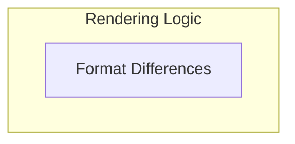

# Difference Rendering Module

## Introduction
The `difference_rendering` module is a vital part of the `pydantic_evals` framework, specifically designed for converting numerical and temporal differences into human-readable string formats. This is crucial for reporting and visualization, allowing users to quickly understand the magnitude and direction of changes between two values, such as performance metrics or evaluation results.

## Architecture Overview
The `difference_rendering` module encapsulates the logic for comparing and formatting different types of numerical values. It provides specialized functions to handle general number comparisons and duration-specific comparisons, presenting the deltas with appropriate signs, percentages, or multipliers.

The module is structured around a core sub-module that provides these formatting capabilities.

<!-- DIAGRAM_JSON
{
    "direction": "TD",
    "nodes": [
        {
            "id": "difference_rendering",
            "label": "Difference Rendering",
            "type": "module"
        },
        {
            "id": "diff_formatters",
            "label": "Format Differences",
            "type": "module",
            "link": "diff_formatters.md"
        }
    ],
    "edges": [],
    "groups": [
        {
            "id": "rendering_logic",
            "label": "Rendering Logic",
            "role": "analytical",
            "nodes": [
                "diff_formatters"
            ]
        }
    ]
}
-->

## Sub-modules
The `difference_rendering` module contains the following key sub-module:

-   **[Difference Formatters](diff_formatters.md)**: This sub-module contains the core logic for rendering differences between numbers and durations, providing clear and concise representations of change. It handles both absolute and relative difference calculations.
