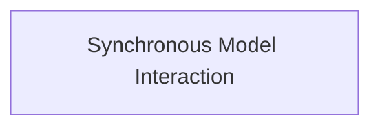

# direct_model_requests Module Documentation

## Introduction

The `direct_model_requests` module provides a synchronous interface for making requests to AI models. It offers convenience methods to interact with various models, abstracting away the asynchronous nature of the underlying model request mechanisms. This module is particularly useful for applications that require blocking calls to AI models, providing both streamed and non-streamed response options.

## Architecture

The `direct_model_requests` module is composed of a single sub-module that handles all synchronous interactions with AI models. The architecture is straightforward, providing direct access to model request functionalities.

<!-- DIAGRAM_JSON
{
    "direction": "TD",
    "nodes": [
        {"id": "synchronous_model_requests", "label": "Synchronous Model Interaction", "type": "module", "link": "synchronous_model_requests.md"}
    ],
    "edges": [],
    "groups": []
}
-->

## Sub-modules

### [Synchronous Model Interaction](synchronous_model_requests.md)

This sub-module provides the core functionality for making synchronous requests to AI models. It includes methods for both single-response and streamed-response interactions, wrapping asynchronous operations to present a synchronous API. This is crucial for integrating AI model calls into synchronous application flows without requiring extensive refactoring for asynchronous programming.