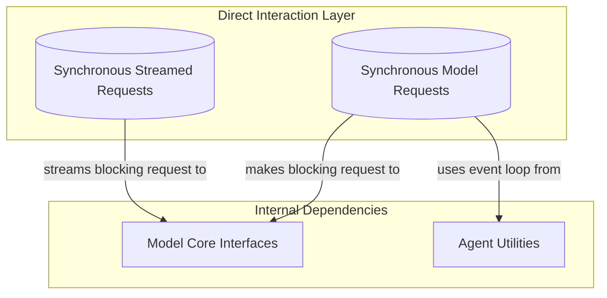

# Direct Model Requests Module

This module provides synchronous interfaces for interacting directly with AI models, offering both single-response and streamed-response functionalities. It acts as a bridge, allowing developers to make AI model requests in a traditional synchronous programming style while internally handling asynchronous operations.

## Architecture Overview

The `direct_model_requests` module orchestrates synchronous interactions with AI models by wrapping underlying asynchronous model request mechanisms. It presents a simplified, blocking API to the user, making it easier to integrate AI capabilities into synchronous applications without dealing with event loops or `async/await` syntax directly.

<!-- DIAGRAM_JSON
{
    "direction": "TD",
    "nodes": [
        {"id": "synchronous_requests", "label": "Synchronous Model Requests", "type": "module", "link": "synchronous_requests.md"},
        {"id": "synchronous_streamed_requests", "label": "Synchronous Streamed Requests", "type": "module", "link": "synchronous_streamed_requests.md"},
        {"id": "model_core_interfaces", "label": "Model Core Interfaces", "type": "external", "link": "model_core_interfaces.md"},
        {"id": "agent_utilities", "label": "Agent Utilities", "type": "external", "link": "agent_utilities.md"}
    ],
    "edges": [
        {"source": "synchronous_requests", "target": "model_core_interfaces", "label": "makes blocking request to"},
        {"source": "synchronous_streamed_requests", "target": "model_core_interfaces", "label": "streams blocking request to"},
        {"source": "synchronous_requests", "target": "agent_utilities", "label": "uses event loop from"}
    ],
    "groups": [
        {
            "id": "direct_interaction",
            "label": "Direct Interaction Layer",
            "role": "surface",
            "nodes": ["synchronous_requests", "synchronous_streamed_requests"]
        },
        {
            "id": "dependencies",
            "label": "Internal Dependencies",
            "role": "generative", 
            "nodes": ["model_core_interfaces", "agent_utilities"]
        }
    ]
}
-->

## Sub-modules

### [Synchronous Model Requests](synchronous_requests.md)
This sub-module focuses on providing a direct, synchronous function for sending a message sequence to an AI model and receiving a single, non-streamed response. It is ideal for straightforward request-response scenarios where real-time streaming updates are not required.

### [Synchronous Streamed Requests](synchronous_streamed_requests.md)
This sub-module offers a synchronous context manager that allows consumers to iterate over streamed responses from an AI model. It internally manages the conversion of an asynchronous stream into a synchronous iterable, providing a convenient way to handle partial responses as they arrive without dealing with asynchronous complexities directly.
