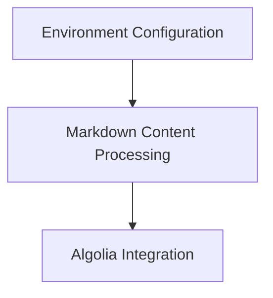

# docs_hooks Module Documentation

The `docs_hooks` module provides a set of custom hooks for the MkDocs documentation generation process. These hooks extend MkDocs' functionality to enhance content processing, search integration, and overall documentation site behavior.

## Architecture Overview

The `docs_hooks` module is composed of several independent sub-modules, each responsible for a specific aspect of the documentation build pipeline. These sub-modules interact with different stages of the MkDocs build process (e.g., `on_page_content`, `on_page_markdown`, `on_env`, `on_post_build`) to modify or augment the generated documentation.

<!-- DIAGRAM_JSON
{
    "direction": "TD",
    "nodes": [
        {"id": "algolia_integration", "label": "Algolia Integration", "type": "module", "link": "algolia_integration.md"},
        {"id": "environment_configuration", "label": "Environment Configuration", "type": "module", "link": "environment_configuration.md"},
        {"id": "markdown_content_hooks", "label": "Markdown Content Processing", "type": "module", "link": "markdown_content_hooks.md"}
    ],
    "edges": [
        {"source": "algolia_integration", "target": "markdown_content_hooks"},
        {"source": "markdown_content_hooks", "target": "environment_configuration"}
    ],
    "groups": []
}
-->

## Sub-modules

### [Algolia Integration](algolia_integration.md)
This sub-module is responsible for integrating Algolia search into the documentation site. It processes page content to generate search records and handles the post-build step of writing these records to a file for Algolia indexing.

### [Environment and Asset Configuration](environment_configuration.md)
This sub-module focuses on configuring the MkDocs build environment. It adds a build timestamp to the Jinja2 environment and identifies the path to the main JavaScript bundle, which can be useful for cache busting or asset management.

### [Markdown Content Processing](markdown_content_hooks.md)
This sub-module provides hooks to transform the raw markdown content of pages. It includes functionality for injecting code snippets from external files, rendering examples and videos, and creating interactive UI elements like gateway toggles.