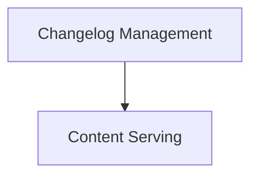

# docs_site_utils Module Documentation

## Introduction

The `docs_site_utils` module provides essential utilities for managing and serving documentation content, including handling static file requests and fetching/formatting release changelogs. It plays a crucial role in ensuring the documentation site is up-to-date and accessible.

## Architecture Overview

The `docs_site_utils` module is composed of two primary sub-modules:

1.  **Changelog Management**: Responsible for interacting with the GitHub API to retrieve release information, caching it, and preparing it for display.
2.  **Content Serving**: Handles incoming requests for documentation files, specifically serving markdown content as plain text when requested.

These sub-modules work in conjunction to provide a robust and dynamic documentation delivery system.

<!-- DIAGRAM_JSON
{
    "direction": "TD",
    "nodes": [
        {"id": "changelog_management", "label": "Changelog Management", "type": "module", "link": "changelog_management.md"},
        {"id": "content_serving", "label": "Content Serving", "type": "module", "link": "content_serving.md"}
    ],
    "edges": [
        {"source": "changelog_management", "target": "content_serving", "label": "provides formatted changelog to"}
    ],
    "groups": []
}
-->

## Sub-modules

### [Changelog Management](changelog_management.md)

This sub-module focuses on the logic required to interact with GitHub's API to fetch release data. It includes functions for making API calls, handling responses, caching mechanisms to optimize performance, and transforming raw release data into a human-readable format suitable for the documentation site.

### [Content Serving](content_serving.md)

The `content_serving` sub-module is responsible for intelligently serving documentation files. Its primary function is to intercept requests for documentation pages and, based on the request headers, serve the raw markdown content as plain text. This ensures flexibility in how documentation is consumed, supporting various client needs.
