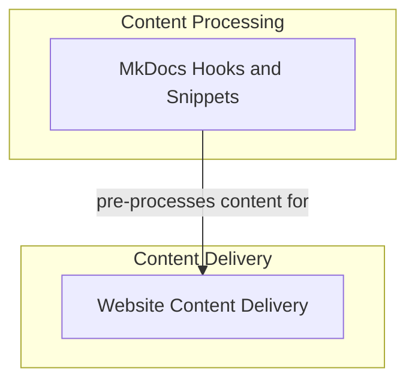

# Documentation Site Management Module

This module is the backbone of the project's documentation website, responsible for both serving dynamic content and integrating with the MkDocs static site generator. It ensures that documentation is well-structured, up-to-date, and easily consumable by users and developers. Its primary purpose is to streamline the documentation pipeline, from content generation and transformation to delivery.

## Architecture Overview

The `documentation_site_management` module operates in two main spheres: the client-facing website content delivery and the build-time MkDocs hooks for content processing. The website content delivery components handle runtime requests for documentation, including dynamic content like changelogs and special text responses. The MkDocs hooks, on the other hand, are invoked during the documentation site generation process to inject code snippets, render dynamic elements, and transform markdown content before it's converted to HTML.

<!-- DIAGRAM_JSON
{
    "direction": "TD",
    "nodes": [
        {
            "id": "documentation_site_management",
            "label": "Documentation Site Management",
            "type": "module"
        },
        {
            "id": "website_content_delivery",
            "label": "Website Content Delivery",
            "type": "module",
            "link": "website_content_delivery.md"
        },
        {
            "id": "mkdocs_hooks_and_snippets",
            "label": "MkDocs Hooks and Snippets",
            "type": "module",
            "link": "mkdocs_hooks_and_snippets.md"
        }
    ],
    "edges": [
        {
            "source": "mkdocs_hooks_and_snippets",
            "target": "website_content_delivery",
            "label": "pre-processes content for"
        }
    ],
    "groups": [
        {
            "id": "content_processing",
            "label": "Content Processing",
            "role": "analytical",
            "nodes": [
                "mkdocs_hooks_and_snippets"
            ]
        },
        {
            "id": "content_delivery",
            "label": "Content Delivery",
            "role": "surface",
            "nodes": [
                "website_content_delivery"
            ]
        }
    ]
}
-->

## Sub-modules

This module is composed of the following key sub-modules:

### Website Content Delivery

This sub-module is responsible for dynamically serving parts of the documentation website. It handles requests for specific content, such as fetching and formatting changelogs from GitHub and serving plain text versions of markdown files when requested. This ensures that the documentation site can present up-to-date and tailored information to users.

For more detailed information, please refer to the [website_content_delivery documentation](website_content_delivery.md).

### MkDocs Hooks and Snippets

This sub-module integrates directly with the MkDocs build process through various hooks. It transforms the raw markdown content before it is converted into HTML, allowing for advanced features like injecting code snippets from the repository, rendering dynamic content, and managing global build-time variables. This enhances the richness and accuracy of the generated documentation.

For more detailed information, please refer to the [mkdocs_hooks_and_snippets documentation](mkdocs_hooks_and_snippets.md).
