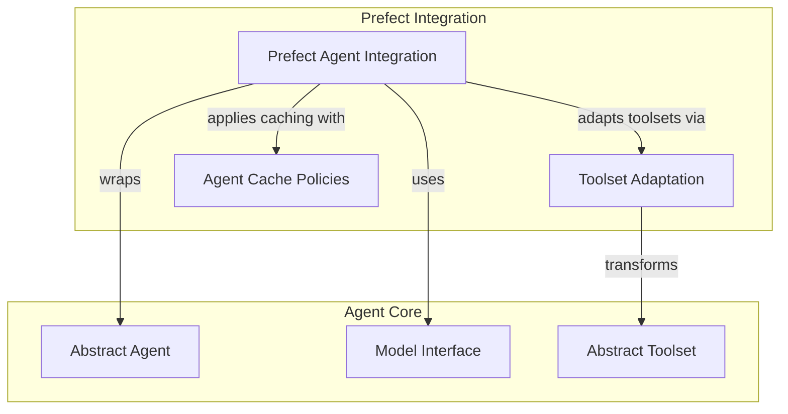

# Durable Execution with Prefect

The `durable_execution_prefect` module provides robust integration with Prefect, a workflow management system, to enable durable execution for AI agents. This module allows AI agents to operate reliably by offloading model requests, tool calls, and event stream handling to Prefect tasks and flows, ensuring resilience, observability, and retriability.

## Architecture Overview

This module wraps existing AI agents, enhancing them with Prefect's capabilities. It focuses on converting key agent operations into Prefect tasks, managing caching policies for agent inputs, and adapting various toolsets to function within a Prefect workflow. This separation of concerns ensures that the core agent logic remains clean while benefiting from Prefect's powerful orchestration features.

<!-- DIAGRAM_JSON
{
    "direction": "TD",
    "nodes": [
        {
            "id": "durable_execution_prefect",
            "label": "Durable Execution with Prefect",
            "type": "module"
        },
        {
            "id": "abstract_agent",
            "label": "Abstract Agent",
            "type": "external",
            "link": "agent_definition.md"
        },
        {
            "id": "abstract_toolset",
            "label": "Abstract Toolset",
            "type": "external",
            "link": "toolset_management.md"
        },
        {
            "id": "model_interface",
            "label": "Model Interface",
            "type": "external",
            "link": "model_core_interfaces.md"
        },
        {
            "id": "prefect_agent_integration",
            "label": "Prefect Agent Integration",
            "type": "module",
            "link": "prefect_agent_integration.md"
        },
        {
            "id": "toolset_adaptation",
            "label": "Toolset Adaptation",
            "type": "module",
            "link": "toolset_adaptation.md"
        },
        {
            "id": "agent_cache_policies",
            "label": "Agent Cache Policies",
            "type": "module",
            "link": "agent_cache_policies.md"
        }
    ],
    "edges": [
        {
            "source": "prefect_agent_integration",
            "target": "abstract_agent",
            "label": "wraps"
        },
        {
            "source": "prefect_agent_integration",
            "target": "model_interface",
            "label": "uses"
        },
        {
            "source": "prefect_agent_integration",
            "target": "toolset_adaptation",
            "label": "adapts toolsets via"
        },
        {
            "source": "prefect_agent_integration",
            "target": "agent_cache_policies",
            "label": "applies caching with"
        },
        {
            "source": "toolset_adaptation",
            "target": "abstract_toolset",
            "label": "transforms"
        }
    ],
    "groups": [
        {
            "id": "agent_components",
            "label": "Agent Core",
            "role": "generative",
            "nodes": [
                "abstract_agent",
                "model_interface",
                "abstract_toolset"
            ]
        },
        {
            "id": "prefect_integration_layer",
            "label": "Prefect Integration",
            "role": "generative",
            "nodes": [
                "prefect_agent_integration",
                "toolset_adaptation",
                "agent_cache_policies"
            ]
        }
    ]
}
-->

## Sub-modules

This module is composed of the following key sub-modules:

*   **[Prefect Agent Integration](prefect_agent_integration.md)**: This sub-module contains the core `PrefectAgent` class, which wraps a standard AI agent to enable durable execution via Prefect. It transparently converts agent operations like model calls and tool executions into Prefect tasks and flows.
*   **[Toolset Adaptation](toolset_adaptation.md)**: Responsible for adapting various toolsets to be compatible with Prefect workflows. It provides functions to wrap `FunctionToolset` and `MCPServer` instances, allowing their methods to be executed as Prefect tasks.
*   **[Agent Cache Policies](agent_cache_policies.md)**: Defines caching strategies specifically for `PrefectAgent` inputs. The `PrefectAgentInputs` policy ensures that cache keys are computed correctly by filtering out non-essential or non-hashable fields from agent inputs.
