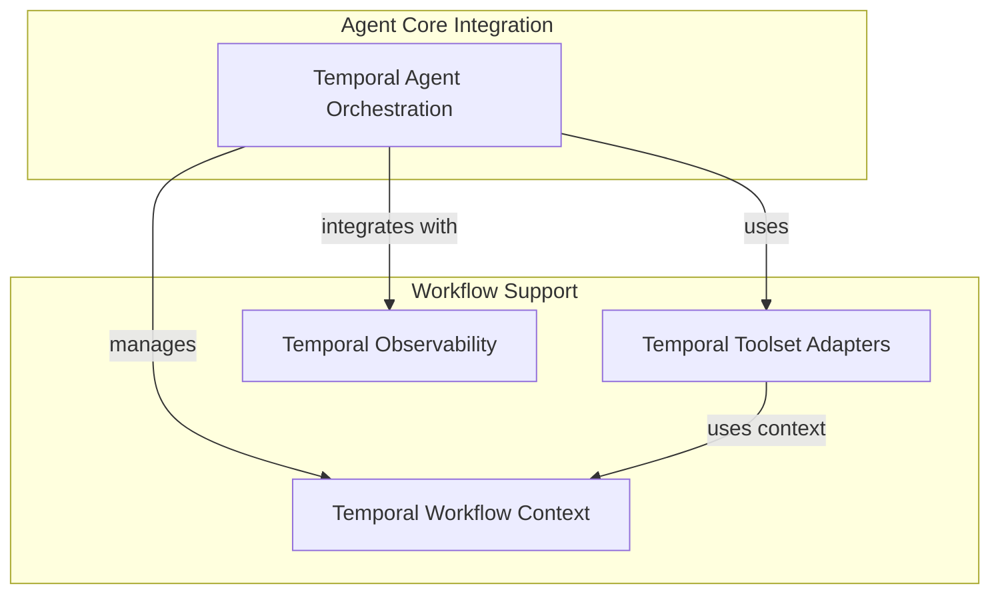

# Durable Execution with Temporal

The `durable_execution_temporal` module provides a robust framework for integrating AI agents with Temporal workflows. This integration enables agents to execute durably, with automatic retry mechanisms, long-running operations, and fault tolerance, by offloading model requests, tool calls, and other I/O operations to Temporal activities. This module is crucial for building reliable and scalable AI applications that require stateful, long-running processes.

## Architecture Overview

The module extends the core AI agent functionality to leverage Temporal's durable execution capabilities. A `TemporalAgent` wraps an existing agent, intercepting operations that require I/O or long-running execution and converting them into Temporal activities. This ensures that the agent's state and execution progress are preserved across system failures and restarts.

Key architectural aspects include:
*   **TemporalAgent:** The central orchestrator that adapts a standard AI agent for Temporal workflows.
*   **Temporal Toolset Adapters:** Components that transform regular toolsets into Temporal-compatible ones, allowing individual tool calls to become activities.
*   **Temporal Run Context:** A specialized context object that ensures agent state is correctly serialized and deserialized when passed between workflows and activities.
*   **Observability:** Integration with Logfire for detailed tracing and monitoring of agent execution within Temporal.

<!-- DIAGRAM_JSON
{
    "direction": "TD",
    "nodes": [
        {"id": "temporal_agent_orchestration", "label": "Temporal Agent Orchestration", "type": "module", "link": "temporal_agent_orchestration.md"},
        {"id": "temporal_toolset_adapters", "label": "Temporal Toolset Adapters", "type": "module", "link": "temporal_toolset_adapters.md"},
        {"id": "temporal_workflow_context", "label": "Temporal Workflow Context", "type": "module", "link": "temporal_workflow_context.md"},
        {"id": "temporal_observability", "label": "Temporal Observability", "type": "module", "link": "temporal_observability.md"}
    ],
    "edges": [
        {"source": "temporal_agent_orchestration", "target": "temporal_toolset_adapters", "label": "uses"},
        {"source": "temporal_agent_orchestration", "target": "temporal_workflow_context", "label": "manages"},
        {"source": "temporal_agent_orchestration", "target": "temporal_observability", "label": "integrates with"},
        {"source": "temporal_toolset_adapters", "target": "temporal_workflow_context", "label": "uses context"}
    ],
    "groups": [
        {
            "id": "agent_core",
            "label": "Agent Core Integration",
            "role": "generative",
            "nodes": ["temporal_agent_orchestration"]
        },
        {
            "id": "workflow_support",
            "label": "Workflow Support",
            "role": "analytical",
            "nodes": ["temporal_toolset_adapters", "temporal_workflow_context", "temporal_observability"]
        }
    ]
}
-->

## Sub-modules

*   **[Temporal Agent Orchestration](temporal_agent_orchestration.md)**: This sub-module is centered around the `TemporalAgent` class, which acts as a wrapper around a standard AI agent. It is responsible for intercepting agent operations like model calls and tool executions, and transforming them into durable Temporal activities. This ensures that long-running agent tasks are resilient to failures and maintain state across executions.
*   **[Temporal Toolset Adapters](temporal_toolset_adapters.md)**: This sub-module provides the necessary infrastructure to adapt various toolsets for use within Temporal workflows. It includes `temporalize_toolset`, a function that wraps different types of toolsets (e.g., `FunctionToolset`, `DynamicToolset`, `MCPServer`) with Temporal-specific logic, allowing their individual tools to be executed as Temporal activities. The `TemporalWrapperToolset` serves as a base for these adaptations, handling the serialization and deserialization of tool call results and managing their lifecycle within activities.
*   **[Temporal Workflow Context](temporal_workflow_context.md)**: This sub-module defines the `TemporalRunContext`, a specialized run context for agents operating within Temporal workflows. It dictates which parts of the agent's execution context (`deps`, `run_id`, `metadata`, etc.) are serialized and deserialized when passed between a Temporal workflow and its activities. This is crucial for maintaining the agent's state across activity boundaries and ensuring data integrity during durable execution.
*   **[Temporal Observability](temporal_observability.md)**: This sub-module focuses on integrating observability tools, specifically Logfire, into the Temporal-backed AI agent system. The `_default_setup_logfire` function provides a convenient way to configure Logfire for tracing and monitoring the execution of Temporal workflows and activities, offering insights into the agent's behavior and performance.

## Connections to Other Modules

This module heavily relies on the [agent_definition](agent_definition.md) module for the `AbstractAgent` interface, allowing it to wrap any compliant agent. It also interacts with [toolset_management](toolset_management.md) for handling `AbstractToolset` instances and transforming them. The [model_core_interfaces](model_core_interfaces.md) and [direct_model_requests](direct_model_requests.md) modules provide the underlying model interaction mechanisms that `TemporalAgent` ultimately offloads to Temporal activities. Furthermore, it depends on [mcp_core](mcp_core.md) when dealing with `MCPServer` instances for durable execution.
