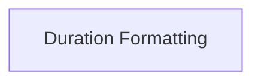

<!-- AUTO_GENERATED_PLACEHOLDER
  reason: LLM did not create .md file for this module
  module_path: pydantic_evals_framework/reporting_and_rendering/duration_formatting
  component_count: 1
  generated_at: 2026-04-06T06:47:34.949162
  TODO: Fix LLM prompt to handle small leaf modules
-->

# Duration Formatting

> ⚠️ **Auto-Generated Placeholder**
> This documentation was auto-generated because the LLM failed to create it.
> Module path: `pydantic_evals_framework/reporting_and_rendering/duration_formatting`

Handles the formatting of single duration values into human-readable strings, adapting units based on magnitude (microseconds, milliseconds, or seconds).

## Components

This module contains 1 component(s):

- `pydantic_evals.pydantic_evals.reporting.render_numbers.default_render_duration`

## Structure

---
*Auto-generated placeholder. See sync_issues.json for details.*
