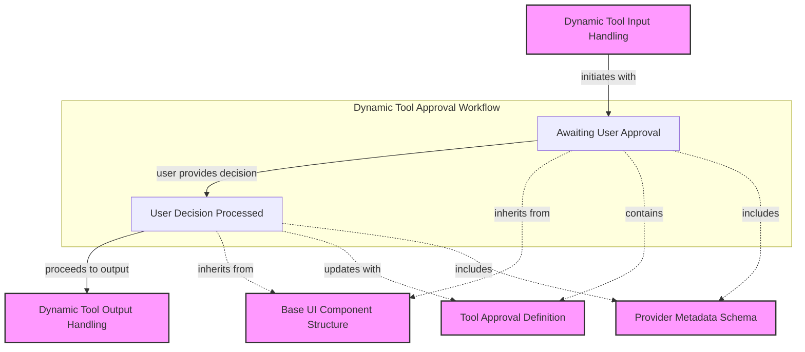

# dynamic_tool_approval_states Module Documentation

## Introduction
The `dynamic_tool_approval_states` module is a crucial component within the `pydantic_ai_agent_core`'s UI interaction layer, specifically designed for handling the lifecycle of dynamic tool calls that require user approval. This module defines the states a dynamic tool request transitions through when user intervention is necessary, ensuring a clear process for awaiting and recording user decisions before tool execution proceeds. It is an integral part of enabling interactive and safely governed agent operations within the Vercel AI frontend.

## Module Overview
This module defines two primary Pydantic models: `DynamicToolApprovalRequestedPart` and `DynamicToolApprovalRespondedPart`. These models represent the distinct phases of a dynamic tool call that requires explicit user approval.

-   **`DynamicToolApprovalRequestedPart`**: This state signifies that a dynamic tool call has been initiated by the agent and is currently awaiting a decision from the user. It contains all necessary information about the tool call, including its name, a unique identifier, the input data for the tool, and any relevant provider metadata. The agent pauses its execution at this point, waiting for the user to either approve or deny the proposed tool execution.

-   **`DynamicToolApprovalRespondedPart`**: Once the user has interacted with the UI and provided their decision (approve or deny), the tool call transitions into this `approval-responded` state. This state records the user's decision, allowing the system to proceed with or cancel the tool's execution accordingly. The information carried by this part is similar to the `requested` state, but crucially includes the user's `approval` choice.

Together, these components facilitate a robust and transparent mechanism for human-in-the-loop control over dynamic tool usage, which is essential for sensitive operations or when user confirmation is preferred.

<!-- DIAGRAM_JSON
{
    "direction": "TD",
    "nodes": [
        {"id": "approval_requested", "label": "Awaiting User Approval", "type": "component", "link": null},
        {"id": "approval_responded", "label": "User Decision Processed", "type": "component", "link": null},
        {"id": "dynamic_tool_input_states", "label": "Dynamic Tool Input Handling", "type": "external", "link": "dynamic_tool_input_states.md"},
        {"id": "dynamic_tool_output_states", "label": "Dynamic Tool Output Handling", "type": "external", "link": "dynamic_tool_output_states.md"},
        {"id": "base_ui_part", "label": "Base UI Component Structure", "type": "external", "link": "vercel_ai_response_types.md"},
        {"id": "tool_approval_type", "label": "Tool Approval Definition", "type": "external", "link": "toolset_management.md"},
        {"id": "provider_metadata_type", "label": "Provider Metadata Schema", "type": "external", "link": "model_provider_configurations.md"}
    ],
    "edges": [
        {"source": "dynamic_tool_input_states", "target": "approval_requested", "label": "initiates with"},
        {"source": "approval_requested", "target": "approval_responded", "label": "user provides decision"},
        {"source": "approval_responded", "target": "dynamic_tool_output_states", "label": "proceeds to output"},
        {"source": "approval_requested", "target": "base_ui_part", "label": "inherits from"},
        {"source": "approval_responded", "target": "base_ui_part", "label": "inherits from"},
        {"source": "approval_requested", "target": "tool_approval_type", "label": "contains"},
        {"source": "approval_responded", "target": "tool_approval_type", "label": "updates with"},
        {"source": "approval_requested", "target": "provider_metadata_type", "label": "includes"},
        {"source": "approval_responded", "target": "provider_metadata_type", "label": "includes"}
    ],
    "groups": [
        {
            "id": "dynamic_tool_approval_workflow",
            "label": "Dynamic Tool Approval Workflow",
            "role": "process",
            "nodes": ["approval_requested", "approval_responded"]
        }
    ]
}
-->

## Core Components

### `DynamicToolApprovalRequestedPart`
(Defined in `pydantic_ai_slim/pydantic_ai/ui/vercel_ai/request_types.py`)

This Pydantic model represents a dynamic tool call that has been identified by the agent as requiring user approval before execution. It serves as a data structure to communicate the details of the pending tool call to the UI.

**Key Fields:**
*   `type`: Always `'dynamic-tool'`.
*   `tool_name`: The name of the tool being requested for approval.
*   `tool_call_id`: A unique identifier for this specific tool call.
*   `state`: Fixed as `'approval-requested'`, indicating its current phase.
*   `input`: The raw input data intended for the tool. This could be any `Any` type.
*   `call_provider_metadata`: Optional metadata related to the tool call's provider, if applicable.
*   `approval`: Initially `None`, as the approval has not yet been given.

### `DynamicToolApprovalRespondedPart`
(Defined in `pydantic_ai_slim/pydantic_ai/ui/vercel_ai/request_types.py`)

This model represents the state of a dynamic tool call *after* the user has responded to the approval request. It encapsulates the user's decision along with the original tool call details, preparing it for the next stage of execution or cancellation.

**Key Fields:**
*   `type`: Always `'dynamic-tool'`.
*   `tool_name`: The name of the tool.
*   `tool_call_id`: The unique identifier for the tool call, matching the `approval-requested` part.
*   `state`: Fixed as `'approval-responded'`, indicating the user's decision has been received.
*   `input`: The input data for the tool, consistent with the `approval-requested` part.
*   `call_provider_metadata`: Optional provider metadata, consistent with the `approval-requested` part.
*   `approval`: This field will contain the user's `ToolApproval` decision (e.g., approved, denied) and any associated reason.

## How it Connects to the System

The `dynamic_tool_approval_states` module is tightly integrated into the broader `pydantic_ai_agent_core`'s `ui_vercel_ai_adapter` system, specifically within the workflow for [dynamic tool requests](dynamic_tool_requests.md).

1.  **Initiation**: When an agent determines it needs to call a dynamic tool that requires user confirmation, the system generates a `DynamicToolApprovalRequestedPart`. This part is then sent to the Vercel AI frontend as part of the streaming response.
2.  **User Interaction**: The frontend UI renders this `approval-requested` part, presenting the tool details and input to the user, allowing them to make an informed decision to approve or deny the tool's execution.
3.  **Response Handling**: Once the user makes a choice, the UI sends back a request to the backend, which is then processed to create a `DynamicToolApprovalRespondedPart`. This part, now containing the `ToolApproval` object with the user's decision, signals the system to either proceed with the tool's execution (if approved) or gracefully halt it (if denied).
4.  **Workflow Progression**: After the `approval-responded` state, the workflow typically moves to [dynamic_tool_output_states](dynamic_tool_output_states.md) if the tool was approved and executed successfully, or to other error handling if denied or execution failed. This module effectively acts as a gatekeeper, ensuring that dynamic tools are only executed with explicit user consent when configured to do so.

It depends on external definitions for basic UI component structures (from [vercel_ai_response_types](vercel_ai_response_types.md)), the definition of what constitutes a `ToolApproval` (likely from [toolset_management](toolset_management.md)), and `ProviderMetadata` schemas (from [model_provider_configurations](model_provider_configurations.md)) to fully describe the state of these tool interactions.