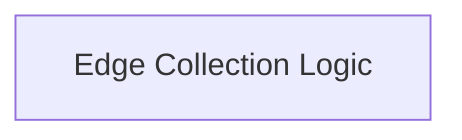

<!-- AUTO_GENERATED_PLACEHOLDER
  reason: LLM did not create .md file for this module
  module_path: pydantic_ai_agent_core/graph_visualization/mermaid_graph_rendering/edge_collection
  component_count: 1
  generated_at: 2026-04-06T06:47:34.943869
  TODO: Fix LLM prompt to handle small leaf modules
-->

# Edge Collection Logic

> ⚠️ **Auto-Generated Placeholder**
> This documentation was auto-generated because the LLM failed to create it.
> Module path: `pydantic_ai_agent_core/graph_visualization/mermaid_graph_rendering/edge_collection`

Handles the dynamic collection and generation of graph edges from processed paths within the graph structure.

## Components

This module contains 1 component(s):

- `pydantic_graph.pydantic_graph.beta.mermaid._collect_edges`

## Structure

---
*Auto-generated placeholder. See sync_issues.json for details.*
