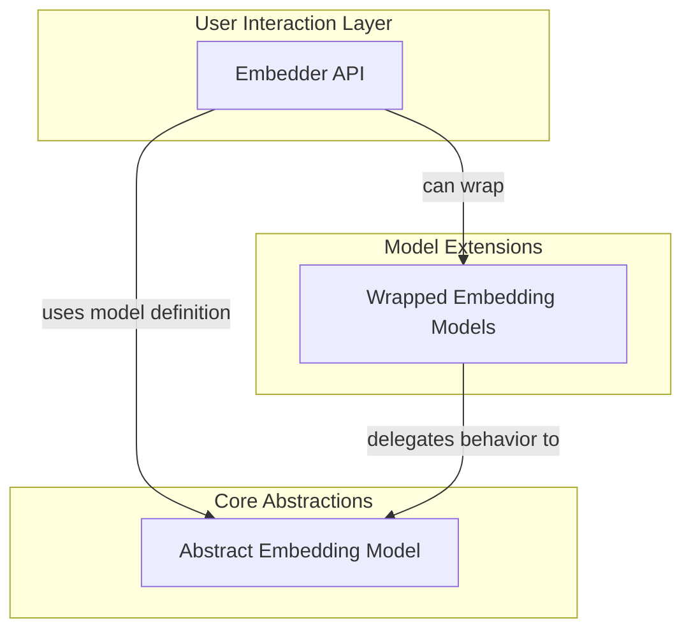

# Embedding Core Module

The `embedding_core` module provides the foundational components for generating and managing vector embeddings from text within the Pydantic AI framework. It offers a high-level, user-friendly interface for embedding operations while allowing for flexible model integration and extensibility. This module is crucial for applications requiring semantic search, similarity comparisons, and other tasks that leverage vector representations of text.

## Architecture Overview

The `embedding_core` module is structured to separate the primary user interface from the underlying model implementations and wrapper functionalities. This design promotes clear separation of concerns, making it easier to integrate new embedding models and extend existing behaviors.

<!-- DIAGRAM_JSON
{
    "direction": "TD",
    "nodes": [
        {"id": "embedding_interface", "label": "Embedding Interface", "type": "module", "link": "embedding_interface.md"},
        {"id": "base_embedding_model", "label": "Base Embedding Model", "type": "module", "link": "base_embedding_model.md"},
        {"id": "wrapper_embedding_model", "label": "Wrapper Embedding Model", "type": "module", "link": "wrapper_embedding_model.md"}
    ],
    "edges": [
        {"source": "embedding_interface", "target": "base_embedding_model", "label": "uses model definition"},
        {"source": "wrapper_embedding_model", "target": "base_embedding_model", "label": "delegates behavior to"},
        {"source": "embedding_interface", "target": "wrapper_embedding_model", "label": "can wrap"}
    ],
    "groups": [
        {
            "id": "user_interaction",
            "label": "User Interaction Layer",
            "role": "surface",
            "nodes": ["embedding_interface"]
        },
        {
            "id": "core_abstractions",
            "label": "Core Abstractions",
            "role": "generative",
            "nodes": ["base_embedding_model"]
        },
        {
            "id": "model_extensions",
            "label": "Model Extensions",
            "role": "generative",
            "nodes": ["wrapper_embedding_model"]
        }
    ]
}
-->

## Sub-modules

### [Embedding Interface](embedding_interface.md)
This sub-module provides the `Embedder` class, serving as the main entry point for users to generate text embeddings. It abstracts away the complexities of different embedding models and providers, offering a consistent API for embedding queries and documents.

### [Base Embedding Model](base_embedding_model.md)
The `Base Embedding Model` sub-module defines the `EmbeddingModel` abstract base class. This class establishes the fundamental contract and common functionalities that all concrete embedding model implementations must adhere to, ensuring interoperability and a standardized approach to embedding generation.

### [Wrapper Embedding Model](wrapper_embedding_model.md)
This sub-module introduces the `WrapperEmbeddingModel`, a base class for creating embedding models that encapsulate and extend the functionality of other existing embedding models. It facilitates the development of custom behaviors such as caching, logging, or rate limiting, while delegating core embedding tasks to a wrapped model.

## Related Modules

- **[Embedding Provider Integrations](embedding_provider_integrations.md)**: This module contains concrete implementations for various embedding service providers (e.g., OpenAI, Cohere, Google, Bedrock), which are leveraged by the `embedding_core` module.
- **[Model Core Interfaces](model_core_interfaces.md)**: Provides foundational interfaces for general AI models, which `EmbeddingModel` extends in its design.
- **[Agent Utilities](agent_utilities.md)**: Contains shared utility functions like `get_event_loop` which are used by `Embedder` for asynchronous operations.
