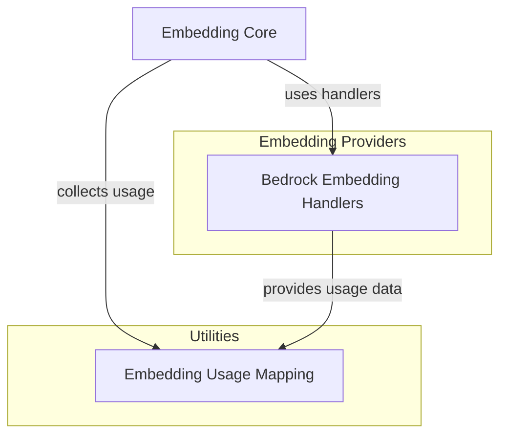

# Embedding Provider Integrations

The `embedding_provider_integrations` module is responsible for abstracting and integrating with various third-party embedding providers. It provides specialized handlers for different embedding models and utility functions for standardizing usage reporting across these diverse services. This module is crucial for allowing the system to seamlessly switch between or combine embedding services without requiring extensive changes to the core logic.

## Architecture Overview

This module primarily consists of two functional areas: dedicated handlers for specific embedding platforms (like AWS Bedrock) and general utilities for mapping usage data from various providers into a consistent format. These components work together to ensure that embedding requests are correctly formatted for the target provider and that billing and usage information is uniformly captured.

<!-- DIAGRAM_JSON
{
    "direction": "TD",
    "nodes": [
        {"id": "embedding_core", "label": "Embedding Core", "type": "external", "link": "embedding_core.md"},
        {"id": "bedrock_embedding_handlers", "label": "Bedrock Embedding Handlers", "type": "module", "link": "bedrock_embedding_handlers.md"},
        {"id": "embedding_usage_mapping", "label": "Embedding Usage Mapping", "type": "module", "link": "embedding_usage_mapping.md"}
    ],
    "edges": [
        {"source": "embedding_core", "target": "bedrock_embedding_handlers", "label": "uses handlers"},
        {"source": "embedding_core", "target": "embedding_usage_mapping", "label": "collects usage"},
        {"source": "bedrock_embedding_handlers", "target": "embedding_usage_mapping", "label": "provides usage data"}
    ],
    "groups": [
        {
            "id": "embedding_providers",
            "label": "Embedding Providers",
            "role": "surface",
            "nodes": ["bedrock_embedding_handlers"]
        },
        {
            "id": "utilities",
            "label": "Utilities",
            "role": "data",
            "nodes": ["embedding_usage_mapping"]
        }
    ]
}
-->

## Sub-modules

This module contains the following key sub-modules:

*   **[Bedrock Embedding Handlers](bedrock_embedding_handlers.md)**: Manages specific implementations for handling embedding requests and responses from various models on the AWS Bedrock platform.
*   **[Embedding Usage Mapping](embedding_usage_mapping.md)**: Provides utility functions for mapping embedding model response usage data into a standardized format across different providers.