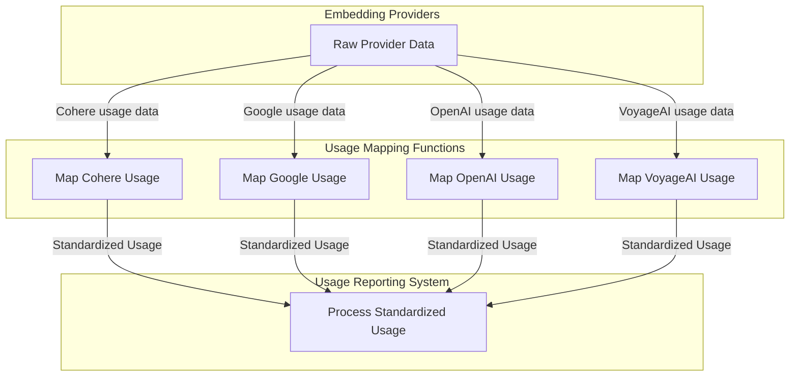

# Embedding Usage Mapping Module

## Introduction and Purpose

The `embedding_usage_mapping` module is critical for standardizing how usage metrics are processed and reported from various embedding model providers. It acts as an abstraction layer, transforming provider-specific usage data into a consistent `RequestUsage` object. This standardization is vital for accurate cost tracking, analytics, and enabling uniform handling of usage information across different embedding services within the system.

By centralizing the mapping logic, this module ensures that new embedding providers can be integrated with minimal impact on downstream systems that consume usage data.

## Architecture Overview

This module functions as a specialized adapter within the broader embedding ecosystem. It receives raw usage information directly from the respective embedding provider integrations (e.g., Cohere, Google, OpenAI, VoyageAI). Each provider has a dedicated mapping function that understands its specific response structure and extracts the relevant usage statistics. These statistics are then transformed into a unified `RequestUsage` object, which represents a standardized view of resource consumption.

This design promotes modularity, allowing individual provider mapping logic to be updated or extended independently without affecting other parts of the system. The processed `RequestUsage` objects can then be used by other modules for logging, billing, and performance monitoring.

## High-level Functionality

The `embedding_usage_mapping` module comprises several key components, each responsible for handling usage data from a specific embedding provider:

*   **[Cohere Usage Mapping](cohere_usage_mapping.md)**: Responsible for parsing and mapping usage details from Cohere embedding API responses into the standardized `RequestUsage` format.
*   **[Google Usage Mapping](google_usage_mapping.md)**: Handles the extraction and transformation of usage statistics from Google's embedding services, including Gemini and Vertex AI.
*   **[OpenAI Usage Mapping](openai_usage_mapping.md)**: Provides the logic for converting OpenAI and compatible API embedding usage objects into a consistent `RequestUsage` structure.
*   **[VoyageAI Usage Mapping](voyageai_usage_mapping.md)**: Manages the mapping of total token counts from VoyageAI embedding responses into the system's standard usage object.

<!-- DIAGRAM_JSON
{
    "direction": "TD",
    "nodes": [
        {"id": "cohere_usage_mapping", "label": "Map Cohere Usage", "type": "module", "link": "cohere_usage_mapping.md"},
        {"id": "google_usage_mapping", "label": "Map Google Usage", "type": "module", "link": "google_usage_mapping.md"},
        {"id": "openai_usage_mapping", "label": "Map OpenAI Usage", "type": "module", "link": "openai_usage_mapping.md"},
        {"id": "voyageai_usage_mapping", "label": "Map VoyageAI Usage", "type": "module", "link": "voyageai_usage_mapping.md"},
        {"id": "embedding_provider_integrations", "label": "Embedding Providers", "type": "external", "link": "embedding_provider_integrations.md"},
        {"id": "usage_reporting_system", "label": "Usage Reporting System", "type": "external", "link": "usage.md"}
    ],
    "edges": [
        {"source": "embedding_provider_integrations", "target": "cohere_usage_mapping", "label": "Cohere usage data"},
        {"source": "embedding_provider_integrations", "target": "google_usage_mapping", "label": "Google usage data"},
        {"source": "embedding_provider_integrations", "target": "openai_usage_mapping", "label": "OpenAI usage data"},
        {"source": "embedding_provider_integrations", "target": "voyageai_usage_mapping", "label": "VoyageAI usage data"},
        {"source": "cohere_usage_mapping", "target": "usage_reporting_system", "label": "Standardized Usage"},
        {"source": "google_usage_mapping", "target": "usage_reporting_system", "label": "Standardized Usage"},
        {"source": "openai_usage_mapping", "target": "usage_reporting_system", "label": "Standardized Usage"},
        {"source": "voyageai_usage_mapping", "target": "usage_reporting_system", "label": "Standardized Usage"}
    ],
    "groups": [
        {
            "id": "mapping_functions",
            "label": "Usage Mapping Functions",
            "role": "generative",
            "nodes": ["cohere_usage_mapping", "google_usage_mapping", "openai_usage_mapping", "voyageai_usage_mapping"]
        }
    ]
}
-->

