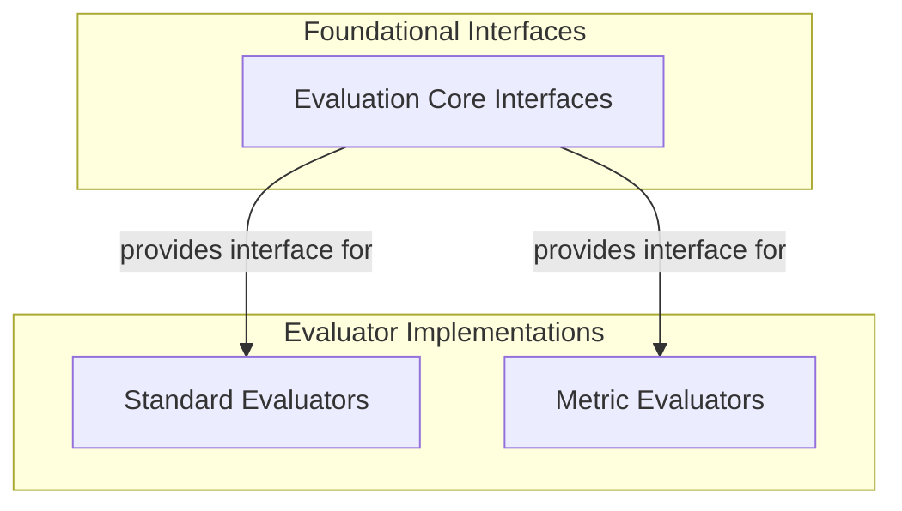

# Evaluation Base Classes

The `evaluation_base_classes` module serves as the foundational layer for defining and implementing various evaluators within the Pydantic Evals framework. It provides the core interfaces and essential utilities for standardizing evaluator behavior, serialization, and integration into the broader evaluation system. This module is critical for ensuring consistency and extensibility across different types of evaluations, from simple checks to complex metric-based assessments.

## Architecture Overview

At its core, the `evaluation_base_classes` module establishes the abstract `Evaluator` class, which all concrete evaluators must extend. This class, built upon the `BaseEvaluator`, provides mechanisms for serialization, argument building, and handling both synchronous and asynchronous evaluation flows. This structure promotes a clear separation of concerns, allowing specific evaluation logic to be implemented while leveraging common infrastructure for lifecycle management and data interchange.

The module integrates with other parts of the evaluation framework by providing the fundamental interfaces that specialized evaluators (e.g., in `standard_evaluators` and `metric_evaluators`) implement. This hierarchical design ensures that all evaluators adhere to a common contract, facilitating their use within evaluation pipelines and reporting tools.

<!-- DIAGRAM_JSON
{
    "direction": "TD",
    "nodes": [
        {"id": "base_evaluator_interfaces", "label": "Evaluation Core Interfaces", "type": "module", "link": "base_evaluator_interfaces.md"},
        {"id": "standard_evaluators", "label": "Standard Evaluators", "type": "module", "link": "standard_evaluators.md"},
        {"id": "metric_evaluators", "label": "Metric Evaluators", "type": "module", "link": "metric_evaluators.md"}
    ],
    "edges": [
        {"source": "base_evaluator_interfaces", "target": "standard_evaluators", "label": "provides interface for"},
        {"source": "base_evaluator_interfaces", "target": "metric_evaluators", "label": "provides interface for"}
    ],
    "groups": [
        {
            "id": "foundational",
            "label": "Foundational Interfaces",
            "role": "generative",
            "nodes": ["base_evaluator_interfaces"]
        },
        {
            "id": "implementations",
            "label": "Evaluator Implementations",
            "role": "analytical",
            "nodes": ["standard_evaluators", "metric_evaluators"]
        }
    ]
}
-->

