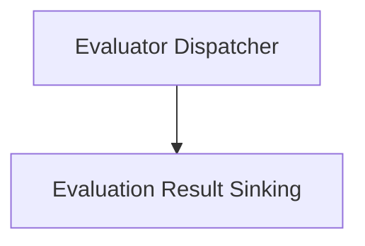

# evaluation_dispatch_and_sinking Module Documentation

## Introduction

The `evaluation_dispatch_and_sinking` module within `pydantic_evals.pydantic_evals.online` is responsible for orchestrating the execution of individual evaluators and managing the submission of their results to various designated sinks. It ensures that evaluations are dispatched efficiently, concurrency limits are respected, and results are reliably recorded, with robust error handling throughout the process.

## Architecture Overview

This module is composed of two primary sub-modules:

1.  **Evaluator Dispatch**: Manages the execution flow of evaluators, including concurrency control and error handling during evaluation runs.
2.  **Evaluation Sinking**: Handles the reliable submission of evaluation outcomes (results and failures) to external storage or reporting mechanisms.

These components work in tandem to provide a robust framework for online evaluation processing.

<!-- DIAGRAM_JSON
{
    "direction": "TD",
    "nodes": [
        {"id": "evaluator_dispatch", "label": "Evaluator Dispatcher", "type": "module", "link": "evaluator_dispatch.md"},
        {"id": "evaluation_sinking", "label": "Evaluation Result Sinking", "type": "module", "link": "evaluation_sinking.md"}
    ],
    "edges": [
        {"source": "evaluator_dispatch", "target": "evaluation_sinking"}
    ],
    "groups": []
}
-->

## Sub-modules

### [Evaluator Dispatch](evaluator_dispatch.md)

This sub-module (`pydantic_evals.pydantic_evals.online._dispatch_single_evaluator`) is responsible for running a single evaluator's evaluation. It incorporates logic for acquiring and releasing semaphores to manage concurrency, and includes error handling for both the evaluation process itself and any actions taken when concurrency limits are hit.

### [Evaluation Result Sinking](evaluation_sinking.md)

The `evaluation_sinking` sub-module (`pydantic_evals.pydantic_evals.online._submit_to_sink`) focuses on reliably submitting evaluation results and failures to a specified `EvaluationSink`. It includes mechanisms to catch and handle exceptions that may occur during the sinking process, directing them to a registered error callback if provided.