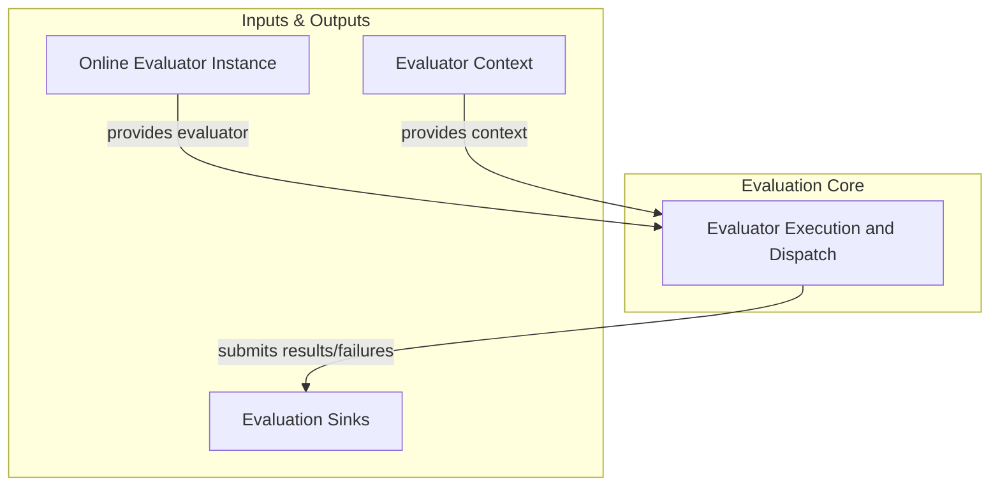

# Evaluation Dispatcher Module

The `evaluation_dispatcher` module is a crucial component within the `pydantic_evals_framework`'s online evaluation system. Its primary responsibility is to manage the lifecycle and execution of individual evaluators, from initial dispatch to the final submission of results to various data sinks.

## Purpose

This module ensures that evaluations are run efficiently, handling concurrency, error conditions, and the structured collection of evaluation outcomes. It acts as the central orchestrator for the execution phase of online evaluations, providing robustness and scalability to the evaluation process.

## Architecture Overview

The `evaluation_dispatcher` module operates within the `evaluator_execution` sub-module of the larger `online_evaluation_system`. It leverages asynchronous programming to handle multiple evaluations concurrently and dispatches the results to predefined sinks. Key interactions include receiving `OnlineEvaluator` instances and their contexts, executing the evaluation logic, and funneling results or failures to `EvaluationSink` components.

<!-- DIAGRAM_JSON
{
    "direction": "TD",
    "nodes": [
        {"id": "evaluator_execution_and_dispatch", "label": "Evaluator Execution and Dispatch", "type": "module", "link": "evaluator_execution_and_dispatch.md"},
        {"id": "online_evaluator", "label": "Online Evaluator Instance", "type": "external"},
        {"id": "evaluator_context", "label": "Evaluator Context", "type": "external"},
        {"id": "evaluation_sink", "label": "Evaluation Sinks", "type": "external"}
    ],
    "edges": [
        {"source": "online_evaluator", "target": "evaluator_execution_and_dispatch", "label": "provides evaluator"},
        {"source": "evaluator_context", "target": "evaluator_execution_and_dispatch", "label": "provides context"},
        {"source": "evaluator_execution_and_dispatch", "target": "evaluation_sink", "label": "submits results/failures"}
    ],
    "groups": [
        {
            "id": "evaluation_core",
            "label": "Evaluation Core",
            "role": "generative",
            "nodes": ["evaluator_execution_and_dispatch"]
        },
        {
            "id": "inputs_outputs",
            "label": "Inputs & Outputs",
            "role": "data",
            "nodes": ["online_evaluator", "evaluator_context", "evaluation_sink"]
        }
    ]
}
-->

## Sub-modules

This module comprises the following key sub-module:

*   **[Evaluator Execution and Dispatch](evaluator_execution_and_dispatch.md)**: This sub-module is responsible for the core logic of running individual evaluators, managing concurrency, handling success and failure states, and dispatching results to configured data sinks.