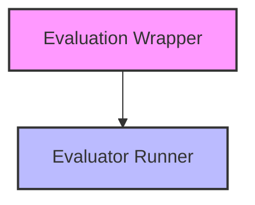

# Evaluation Execution Flow Module

## Introduction

The `evaluation_execution_flow` module is a core component within the `pydantic_evals_core` system, specifically responsible for orchestrating the execution of online evaluations. It wraps functions to be evaluated, captures relevant data during their execution, and dispatches various evaluators to process this data. This module ensures that evaluation logic is seamlessly integrated into existing function calls without requiring significant modifications to the original code.

## Architecture Overview

The module comprises two main sub-modules, working in conjunction to provide a robust evaluation framework:

<!-- DIAGRAM_JSON
{
    "direction": "TD",
    "nodes": [
        {"id": "evaluation_wrapper", "label": "Evaluation Wrapper", "type": "module", "link": "evaluation_wrapper.md"},
        {"id": "evaluator_runner", "label": "Evaluator Runner", "type": "module", "link": "evaluator_runner.md"}
    ],
    "edges": [
        {"source": "evaluation_wrapper", "target": "evaluator_runner"}
    ],
    "groups": []
}
-->

## Sub-modules

### [Evaluation Wrapper](evaluation_wrapper.md)

The `evaluation_wrapper` sub-module is responsible for the primary wrapping logic. It intercepts function calls, determines if evaluation is enabled, captures function inputs and outputs, extracts performance metrics and span trees, and prepares the context for evaluation. It then dispatches the sampled evaluators, either on an existing event loop or in a dedicated background thread.

### [Evaluator Runner](evaluator_runner.md)

The `evaluator_runner` sub-module handles the actual asynchronous execution of individual evaluators. It takes an evaluator instance and the prepared evaluation context, then runs the evaluator to produce results, which are then collected for further processing or sinking. This sub-module is crucial for the concurrent and isolated execution of evaluation tasks.