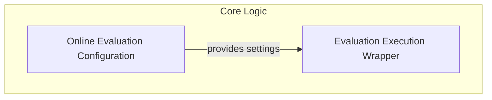

# Evaluation Orchestration Module

## Introduction and Purpose

The `evaluation_orchestration` module is a crucial component within the `pydantic_evals_framework` responsible for managing and executing online evaluations of functions. It provides the mechanisms to configure evaluation behavior, capture function inputs and outputs, extract performance metrics, and dispatch evaluators for asynchronous processing. This module ensures that evaluations can be seamlessly integrated into existing codebases with minimal overhead, supporting flexible sampling, error handling, and result sinking.

## Architecture Overview

The `evaluation_orchestration` module primarily consists of two interconnected components: the `OnlineEvalConfig` which defines the overall evaluation settings, and the `wrapper` function which applies these settings to decorated functions, orchestrating the actual evaluation runtime.

<!-- DIAGRAM_JSON
{
    "direction": "TD",
    "nodes": [
        {"id": "evaluation_configuration", "label": "Online Evaluation Configuration", "type": "module", "link": "evaluation_configuration.md"},
        {"id": "evaluation_wrapper", "label": "Evaluation Execution Wrapper", "type": "module", "link": "evaluation_wrapper.md"}
    ],
    "edges": [
        {"source": "evaluation_configuration", "target": "evaluation_wrapper", "label": "provides settings"}
    ],
    "groups": [
        {
            "id": "core_logic",
            "label": "Core Logic",
            "role": "generative",
            "nodes": ["evaluation_configuration", "evaluation_wrapper"]
        }
    ]
}
-->

## High-level Functionality

The `evaluation_orchestration` module provides the following key functionalities through its sub-modules:

*   ### [Online Evaluation Configuration](evaluation_configuration.md)
    This sub-module (`evaluation_configuration`) defines the global and default settings for online evaluations. It allows users to specify evaluation sinks, sampling rates, sampling modes, metadata, and custom handlers for concurrency limits or errors. It also provides the `evaluate` decorator factory for applying these configurations to functions.

*   ### [Evaluation Execution Wrapper](evaluation_wrapper.md)
    This sub-module (`evaluation_wrapper`) contains the core decorator logic that wraps target functions for online evaluation. It handles the dynamic enabling/disabling of evaluations, captures function arguments, determines which evaluators to sample based on configuration, executes the wrapped function within a span tree context, extracts metrics, builds the evaluation context, and dispatches evaluations asynchronously.