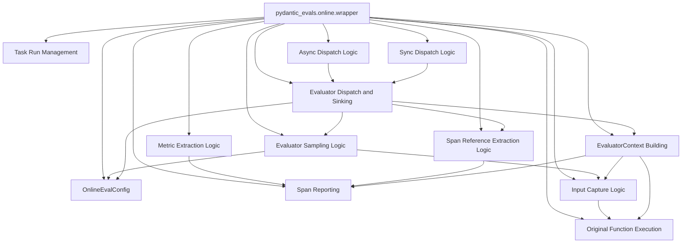

# evaluation_wrapper

The `evaluation_wrapper` module provides a decorator function that enables automatic online evaluation for arbitrary functions. It transparently instruments function calls, captures inputs and outputs, extracts metrics, and dispatches configured evaluators to assess the function's performance and behavior in real-time.

## Purpose and Core Functionality

The primary purpose of the `evaluation_wrapper` module is to offer a non-intrusive way to integrate online evaluation into existing Python functions. By simply decorating a function with the `wrapper`, developers can automatically enable:

*   **Conditional Evaluation**: The wrapper intelligently determines whether evaluation should proceed based on a global configuration (`config.enabled`) and whether the function is already operating within an existing evaluation context. If evaluation is disabled or already active, the original function is called directly without overhead.
*   **Input and Output Capture**: It captures the arguments passed to the wrapped function and its return value, forming the basis for the `EvaluatorContext`.
*   **Evaluator Sampling**: Before execution, the wrapper consults the evaluation configuration to determine which evaluators should be applied to the current function call. This allows for dynamic and condition-based evaluation.
*   **Observability Integration**: The wrapped function's execution is instrumented using `logfire_span`, capturing detailed trace information and a span tree. This span tree is then used to extract standard metrics such as LLM requests, cost, and token usage. This leverages the [pydantic_evals_reporting](pydantic_evals_reporting.md) module for detailed span context management.
*   **Context Building**: An `EvaluatorContext` is constructed, encapsulating all relevant data for evaluators, including inputs, outputs, execution duration, metadata, and extracted metrics/span trees.
*   **Asynchronous Dispatch**: Evaluators are dispatched asynchronously to avoid blocking the main execution thread. The dispatch mechanism intelligently adapts to the environment, either using an existing `asyncio` event loop or spawning a new background thread for synchronous contexts. This dispatch logic relies on components from [evaluation_dispatch_and_sinking](evaluation_dispatch_and_sinking.md).

## Architecture and Component Relationships

The `evaluation_wrapper` module's core `wrapper` function orchestrates several internal processes and interacts with external modules to achieve its functionality.

<!-- DIAGRAM_JSON
{
    "direction": "TD",
    "nodes": [
        {"id": "wrapper", "label": "pydantic_evals.online.wrapper", "type": "component", "link": null},
        {"id": "online_eval_config", "label": "OnlineEvalConfig", "type": "external", "link": "online_evaluation_config.md"},
        {"id": "eval_dispatch", "label": "Evaluator Dispatch and Sinking", "type": "external", "link": "evaluation_dispatch_and_sinking.md"},
        {"id": "span_reporting", "label": "Span Reporting", "type": "external", "link": "pydantic_evals_reporting.md"},
        {"id": "task_run_management", "label": "Task Run Management", "type": "external", "link": "task_run_management.md"},
        {"id": "capture_inputs", "label": "Input Capture Logic", "type": "component", "link": null},
        {"id": "sample_evaluators", "label": "Evaluator Sampling Logic", "type": "component", "link": null},
        {"id": "extract_metrics", "label": "Metric Extraction Logic", "type": "component", "link": null},
        {"id": "extract_span_ref", "label": "Span Reference Extraction Logic", "type": "component", "link": null},
        {"id": "async_dispatch_logic", "label": "Async Dispatch Logic", "type": "component", "link": null},
        {"id": "sync_dispatch_logic", "label": "Sync Dispatch Logic", "type": "component", "link": null},
        {"id": "evaluator_context", "label": "EvaluatorContext Building", "type": "component", "link": null},
        {"id": "wrapped_func", "label": "Original Function Execution", "type": "component", "link": null}
    ],
    "edges": [
        {"source": "wrapper", "target": "online_eval_config"},
        {"source": "wrapper", "target": "wrapped_func"},
        {"source": "wrapper", "target": "capture_inputs"},
        {"source": "capture_inputs", "target": "wrapped_func"},
        {"source": "wrapper", "target": "sample_evaluators"},
        {"source": "sample_evaluators", "target": "online_eval_config"},
        {"source": "sample_evaluators", "target": "capture_inputs"},
        {"source": "wrapper", "target": "span_reporting"},
        {"source": "wrapper", "target": "task_run_management"},
        {"source": "wrapper", "target": "extract_metrics"},
        {"source": "extract_metrics", "target": "span_reporting"},
        {"source": "wrapper", "target": "extract_span_ref"},
        {"source": "extract_span_ref", "target": "span_reporting"},
        {"source": "wrapper", "target": "evaluator_context"},
        {"source": "evaluator_context", "target": "capture_inputs"},
        {"source": "evaluator_context", "target": "wrapped_func"},
        {"source": "evaluator_context", "target": "span_reporting"},
        {"source": "wrapper", "target": "eval_dispatch"},
        {"source": "eval_dispatch", "target": "evaluator_context"},
        {"source": "eval_dispatch", "target": "online_eval_config"},
        {"source": "eval_dispatch", "target": "extract_span_ref"},
        {"source": "eval_dispatch", "target": "sample_evaluators"},
        {"source": "wrapper", "target": "async_dispatch_logic"},
        {"source": "wrapper", "target": "sync_dispatch_logic"},
        {"source": "async_dispatch_logic", "target": "eval_dispatch"},
        {"source": "sync_dispatch_logic", "target": "eval_dispatch"}
    ],
    "groups": []
}
-->

**Component Relationships:**

*   **`pydantic_evals.online.wrapper`**: This is the central component, acting as a decorator.
*   **`online_evaluation_config`**: The `wrapper` consults `OnlineEvalConfig` (from `online_evaluation_config.md`) to check if evaluations are enabled and to determine evaluator sampling rates.
*   **`evaluation_dispatch_and_sinking`**: After collecting all necessary context, the `wrapper` delegates the actual asynchronous dispatch of evaluators to components within `evaluation_dispatch_and_sinking.md`.
*   **`pydantic_evals_reporting`**: The `wrapper` utilizes functionality from `pydantic_evals_reporting.md` (specifically `context_subtree` and related span extraction logic) for capturing detailed telemetry and metrics during the wrapped function's execution.
*   **`task_run_management`**: The `wrapper` interacts with task run management mechanisms (conceptually linked to `task_run_management.md` through `_CURRENT_TASK_RUN` and `_TaskRun`) to ensure evaluations are not recursively triggered and to track the current evaluation context.
*   **Internal Logic Components**: `Input Capture Logic`, `Evaluator Sampling Logic`, `Metric Extraction Logic`, `Span Reference Extraction Logic`, `EvaluatorContext Building`, `Async Dispatch Logic`, `Sync Dispatch Logic`, and `Original Function Execution` represent the sequential internal operations performed by the `wrapper`. These components abstract the helper functions and internal state management within the `online_evaluation_core` module.

## How the Module Fits into the Overall System

The `evaluation_wrapper` module is a crucial part of the `pydantic_evals` online evaluation framework. It provides the primary mechanism for developers to instrument their code for real-time evaluation with minimal effort.

It acts as an **entry point for online evaluations**, seamlessly integrating into the execution flow of any function it decorates. By automating the capture of execution context, metrics, and the dispatch of evaluators, it allows the `pydantic_evals` system to:

1.  **Collect rich data**: Without manual boilerplate, the system gathers inputs, outputs, performance metrics, and detailed span information for every evaluated run.
2.  **Trigger evaluations**: Based on defined criteria and sampling rates, it initiates the evaluation process, leveraging the evaluators defined in modules like `pydantic_evals_evaluators`.
3.  **Provide feedback**: The collected evaluation results can then be used for monitoring, A/B testing, and continuous improvement of models and agents.

This module fundamentally enables the "online" aspect of `pydantic_evals` by bridging the gap between an executing function and the evaluation system, ensuring that relevant data is always available for analysis and assessment. It is a key enabler for observability and automated quality assurance within systems utilizing pydantic-ai-slim.
