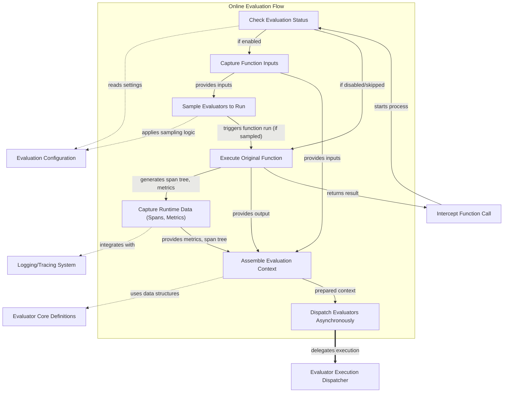

# evaluation_wrapper

The `evaluation_wrapper` module provides a powerful decorator for enabling online evaluation of functions within the `pydantic_evals_framework`. It transparently intercepts function calls, captures critical runtime data, and dispatches various evaluators to assess the function's performance and behavior in real-time. This module is crucial for integrating continuous feedback and quality assurance directly into the application's execution flow.

## Overview

At its core, `evaluation_wrapper` acts as an orchestration layer for online evaluations. When a function decorated with this wrapper is called, it performs several key steps:

1.  **Conditional Activation**: It first checks if online evaluation is globally enabled or if the current execution context permits evaluation. If not, it gracefully bypasses the evaluation logic and simply executes the original function.
2.  **Input and Output Capture**: Before and after the original function's execution, it captures the function's input arguments and its returned output.
3.  **Evaluator Sampling**: Based on configured rules and the captured inputs, it determines which specific evaluators should be run for the current function call. This allows for flexible and efficient evaluation, avoiding unnecessary computations.
4.  **Runtime Data Collection**: During the function's execution, it leverages tracing and logging systems (e.g., Logfire) to capture detailed runtime data, including span trees, execution duration, and extracted metrics like token usage and cost.
5.  **Context Assembly**: All captured data—inputs, outputs, metrics, span trees—are consolidated into a comprehensive `EvaluatorContext` object.
6.  **Asynchronous Dispatch**: The prepared `EvaluatorContext` and the sampled evaluators are then dispatched asynchronously. This ensures that the evaluation process does not block the main application thread, maintaining responsiveness. Depending on the environment, it either dispatches on an existing event loop or spawns a background thread.

This module ensures that evaluations are integrated seamlessly without altering the core business logic of the decorated functions, providing valuable insights into their operational characteristics.

## Architecture

The following diagram illustrates the internal workings of the `evaluation_wrapper` and its interactions with other modules.

<!-- DIAGRAM_JSON
{
    "direction": "TD",
    "nodes": [
        {"id": "evaluation_wrapper", "label": "Intercept Function Call", "type": "component", "link": null},
        {"id": "check_evaluation_status", "label": "Check Evaluation Status", "type": "component", "link": null},
        {"id": "capture_function_inputs", "label": "Capture Function Inputs", "type": "component", "link": null},
        {"id": "determine_evaluators", "label": "Sample Evaluators to Run", "type": "component", "link": null},
        {"id": "execute_original_function", "label": "Execute Original Function", "type": "component", "link": null},
        {"id": "capture_runtime_data", "label": "Capture Runtime Data (Spans, Metrics)", "type": "component", "link": null},
        {"id": "create_evaluation_context", "label": "Assemble Evaluation Context", "type": "component", "link": null},
        {"id": "dispatch_evaluators_async", "label": "Dispatch Evaluators Asynchronously", "type": "component", "link": null},
        {"id": "evaluation_config", "label": "Evaluation Configuration", "type": "external", "link": "evaluation_configuration.md"},
        {"id": "evaluator_definitions", "label": "Evaluator Core Definitions", "type": "external", "link": "evaluator_core.md"},
        {"id": "evaluator_dispatcher", "label": "Evaluator Execution Dispatcher", "type": "external", "link": "evaluator_execution_and_dispatch.md"},
        {"id": "tracing_library", "label": "Logging/Tracing System", "type": "external", "link": null}
    ],
    "edges": [
        {"source": "evaluation_wrapper", "target": "check_evaluation_status", "label": "starts process"},
        {"source": "check_evaluation_status", "target": "evaluation_config", "label": "reads settings", "style": "dotted"},
        {"source": "check_evaluation_status", "target": "capture_function_inputs", "label": "if enabled"},
        {"source": "check_evaluation_status", "target": "execute_original_function", "label": "if disabled/skipped"},
        {"source": "capture_function_inputs", "target": "determine_evaluators", "label": "provides inputs"},
        {"source": "determine_evaluators", "target": "evaluation_config", "label": "applies sampling logic", "style": "dotted"},
        {"source": "determine_evaluators", "target": "execute_original_function", "label": "triggers function run (if sampled)"},
        {"source": "execute_original_function", "target": "capture_runtime_data", "label": "generates span tree, metrics"},
        {"source": "capture_runtime_data", "target": "tracing_library", "label": "integrates with", "style": "dotted"},
        {"source": "capture_function_inputs", "target": "create_evaluation_context", "label": "provides inputs"},
        {"source": "execute_original_function", "target": "create_evaluation_context", "label": "provides output"},
        {"source": "capture_runtime_data", "target": "create_evaluation_context", "label": "provides metrics, span tree"},
        {"source": "create_evaluation_context", "target": "evaluator_definitions", "label": "uses data structures", "style": "dotted"},
        {"source": "create_evaluation_context", "target": "dispatch_evaluators_async", "label": "prepared context"},
        {"source": "dispatch_evaluators_async", "target": "evaluator_dispatcher", "label": "delegates execution", "style": "thick"},
        {"source": "execute_original_function", "target": "evaluation_wrapper", "label": "returns result"}
    ],
    "groups": [
        {
            "id": "evaluation_flow",
            "label": "Online Evaluation Flow",
            "role": "process",
            "nodes": ["check_evaluation_status", "capture_function_inputs", "determine_evaluators", "execute_original_function", "capture_runtime_data", "create_evaluation_context", "dispatch_evaluators_async"]
        }
    ]
}
-->

## Related Modules

*   **[evaluation_configuration.md](evaluation_configuration.md)**: Defines the settings and parameters that control how online evaluations are enabled, sampled, and executed. The `evaluation_wrapper` directly consumes these configurations.
*   **[evaluator_core.md](evaluator_core.md)**: Contains the fundamental definitions for evaluators and the `EvaluatorContext` data structure. The `evaluation_wrapper` creates and populates instances of `EvaluatorContext`.
*   **[evaluator_execution_and_dispatch.md](evaluator_execution_and_dispatch.md)**: Manages the actual asynchronous execution and dispatching of evaluators, which `evaluation_wrapper` delegates to after preparing the evaluation context.