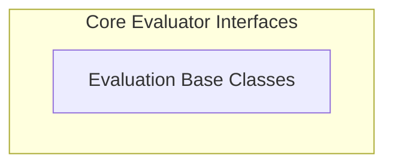

# Evaluator Core Module

The `evaluator_core` module is the foundational component of the `pydantic_evals_framework`, providing the essential interfaces and base classes for defining and executing various types of evaluations. It establishes the common structure for all evaluators, ensuring consistency in serialization, specification building, and the evaluation process itself. This module is crucial for enabling the creation of custom evaluation logic and integrating it seamlessly into the broader evaluation framework.

## Architecture Overview

The `evaluator_core` module is designed around a core set of abstract base classes that other evaluators extend. This architecture promotes reusability and allows for both synchronous and asynchronous evaluation implementations, providing a flexible foundation for diverse evaluation scenarios.

<!-- DIAGRAM_JSON
{
    "direction": "TD",
    "nodes": [
        {"id": "evaluation_base_classes", "label": "Evaluation Base Classes", "type": "module", "link": "evaluation_base_classes.md"}
    ],
    "edges": [],
    "groups": [
        {
            "id": "evaluator_core_components",
            "label": "Core Evaluator Interfaces",
            "role": "analytical",
            "nodes": ["evaluation_base_classes"]
        }
    ]
}
-->

## High-level Functionality

*   **[Evaluation Base Classes](evaluation_base_classes.md)**: This sub-module defines the `BaseEvaluator` and `Evaluator` classes, which are the bedrock for all custom evaluators within the framework. It manages the serialization of evaluator configurations and provides the abstract `evaluate` method that concrete evaluators must implement, supporting both synchronous and asynchronous execution.

## Connections to the System

The `evaluator_core` module serves as a critical dependency for other modules within the `pydantic_evals_framework`, such as [standard_evaluators](standard_evaluators.md) and [metric_evaluators](metric_evaluators.md), which build upon the base classes defined here to provide specific evaluation functionalities. It also interacts with [framework_utilities](framework_utilities.md) for shared utility functions and potentially with [dataset_management](dataset_management.md) for accessing evaluation data.
