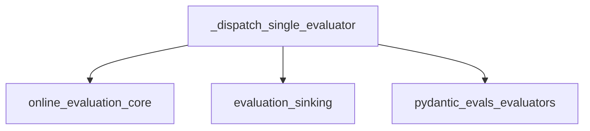

# `evaluator_dispatch`

## Introduction

The `evaluator_dispatch` module is a core component within the `pydantic_evals_core` package, specifically responsible for managing the execution and result submission of individual evaluators in an online evaluation context. It handles concurrency control, error handling, and integrates with various sinks for result storage.

## Architecture and Component Relationships

The `evaluator_dispatch` module contains the primary logic for executing a single evaluation task. It coordinates with several external modules to perform its duties:

- **`online_evaluation_core`**: Provides the `OnlineEvaluator` configuration, `EvaluatorContext` for evaluation data, and the `run_evaluator` function for executing the evaluator logic.
- **`evaluation_sinking`**: Utilizes the `_submit_to_sink` function to send evaluation results and failures to configured `EvaluationSink` instances.
- **`pydantic_evals_evaluators`**: Defines the `BaseEvaluator` interface, `EvaluatorFailure`, and `EvaluationResult` types, which are crucial for the dispatch process.

### `_dispatch_single_evaluator` Function

The `_dispatch_single_evaluator` asynchronous function orchestrates the evaluation process for a single evaluator. Its key responsibilities include:

1.  **Concurrency Control**: It uses a semaphore to limit the number of concurrent evaluator runs, invoking an `on_max_concurrency` callback if the limit is reached.
2.  **Evaluator Execution**: It calls `run_evaluator` (from `online_evaluation_core`) to execute the actual evaluation logic.
3.  **Result Handling**: It processes the `raw_result` from the evaluator, distinguishing between successful `EvaluationResult`s and `EvaluatorFailure`s.
4.  **Sink Submission**: It dispatches the results (or failures) to all configured `EvaluationSink`s using `_submit_to_sink` (from `evaluation_sinking`), ensuring parallel submission via an `anyio` task group.
5.  **Error Handling**: It provides an `on_error` callback to manage exceptions that occur during various stages of the dispatch process.
6.  **Resource Release**: Ensures the semaphore is released in a `finally` block, guaranteeing that resources are freed even if an error occurs.

## How the Module Fits into the Overall System

The `evaluator_dispatch` module is a critical piece of the online evaluation system. It acts as the execution engine for individual evaluation steps, ensuring that each evaluator runs efficiently and its results are properly recorded. It provides the necessary plumbing to connect the evaluation logic with the result storage mechanisms, forming a robust and scalable evaluation pipeline.

It is directly called by higher-level online evaluation orchestrators within the `online_evaluation_core` module to process each evaluation task generated from a dataset.

<!-- DIAGRAM_JSON
{
    "direction": "TD",
    "nodes": [
        {"id": "_dispatch_single_evaluator", "label": "_dispatch_single_evaluator", "type": "component", "link": null},
        {"id": "online_evaluation_core", "label": "online_evaluation_core", "type": "external", "link": "online_evaluation_core.md"},
        {"id": "evaluation_sinking", "label": "evaluation_sinking", "type": "external", "link": "evaluation_sinking.md"},
        {"id": "pydantic_evals_evaluators", "label": "pydantic_evals_evaluators", "type": "external", "link": "pydantic_evals_evaluators.md"}
    ],
    "edges": [
        {"source": "_dispatch_single_evaluator", "target": "online_evaluation_core"},
        {"source": "_dispatch_single_evaluator", "target": "evaluation_sinking"},
        {"source": "_dispatch_single_evaluator", "target": "pydantic_evals_evaluators"}
    ],
    "groups": []
}
-->


```python
async def _dispatch_single_evaluator(
    online_eval: OnlineEvaluator,
    context: EvaluatorContext,
    span_reference: SpanReference | None,
    sinks: list[EvaluationSink],
    on_max_concurrency: Callable[[EvaluatorContext], Any] | None,
    on_error: OnErrorCallback | None,
) -> None:
    """Run a single evaluator's evaluation and sink submission."""
    evaluator = online_eval.evaluator

    if not online_eval.semaphore.acquire(blocking=False):
        if on_max_concurrency is not None:
            try:
                result = on_max_concurrency(context)
                if inspect.isawaitable(result):
                    await result
            except Exception as exc:
                await _call_on_error(on_error, exc, context, evaluator, 'on_max_concurrency')
        return

    try:
        raw_result = await run_evaluator(evaluator, context)

        if isinstance(raw_result, EvaluatorFailure):
            results: Sequence[EvaluationResult] = []
            failures: Sequence[EvaluatorFailure] = [raw_result]
        else:
            results = raw_result
            failures = []

        async with anyio.create_task_group() as tg:
            for sink in sinks:
                tg.start_soon(_submit_to_sink, sink, results, failures, context, span_reference, on_error, evaluator)

    finally:
        online_eval.semaphore.release()
```
