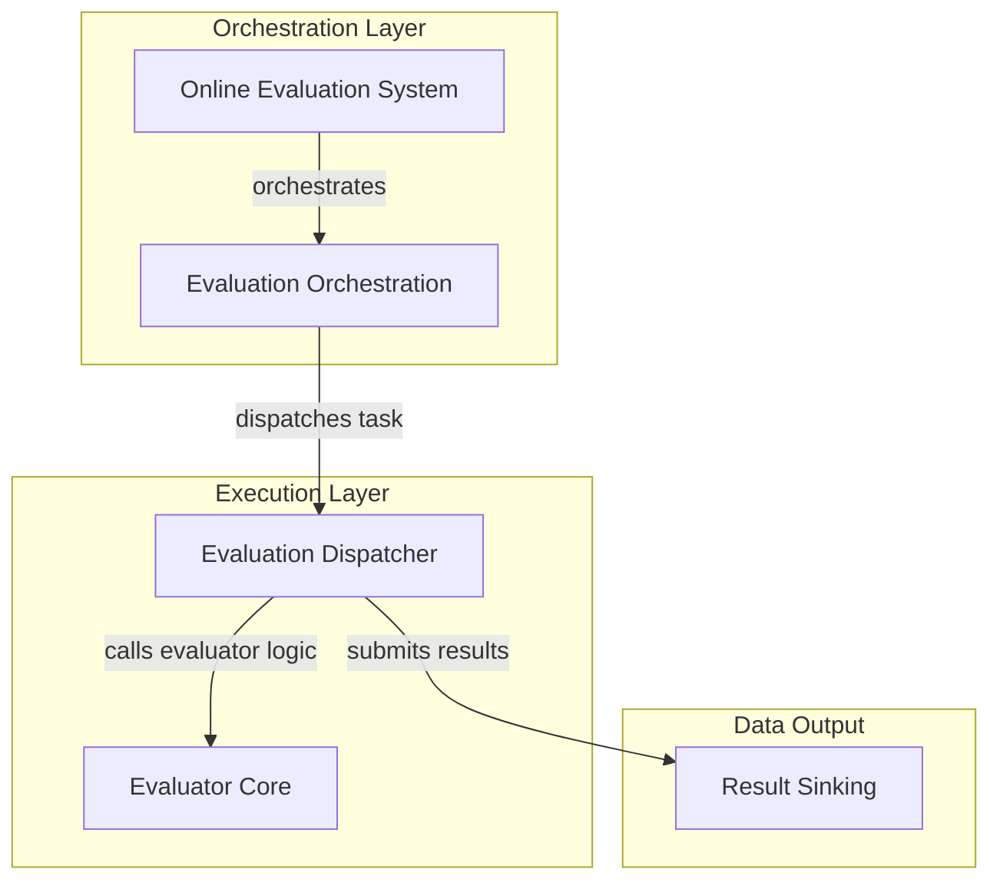

# Evaluator Execution Module

## Introduction and Purpose

The `evaluator_execution` module is a core component within the `pydantic_evals_framework`'s online evaluation system. Its primary purpose is to manage the execution of individual evaluators, ensuring they run efficiently, handle concurrency, and correctly dispatch their results to designated sinks. This module is crucial for robust and scalable evaluation pipelines, enabling the system to process multiple evaluation tasks in parallel while maintaining reliability.

## Architecture Overview

The `evaluator_execution` module acts as an intermediary, receiving evaluation tasks from the [evaluation_orchestration](evaluation_orchestration.md) component and utilizing the [evaluator_core](evaluator_core.md) to perform the actual evaluation logic. It is responsible for concurrency control, error handling, and submitting the evaluation outcomes to the [result_sinking](result_sinking.md) module. The interaction is designed to be asynchronous, allowing for high throughput of evaluation jobs.

<!-- DIAGRAM_JSON
{
    "direction": "TD",
    "nodes": [
        {"id": "online_system", "label": "Online Evaluation System", "type": "module", "link": "online_evaluation_system.md"},
        {"id": "eval_orchestration", "label": "Evaluation Orchestration", "type": "module", "link": "evaluation_orchestration.md"},
        {"id": "eval_dispatcher", "label": "Evaluation Dispatcher", "type": "module", "link": "evaluation_dispatcher.md"},
        {"id": "eval_core", "label": "Evaluator Core", "type": "module", "link": "evaluator_core.md"},
        {"id": "result_sink", "label": "Result Sinking", "type": "module", "link": "result_sinking.md"}
    ],
    "edges": [
        {"source": "online_system", "target": "eval_orchestration", "label": "orchestrates"},
        {"source": "eval_orchestration", "target": "eval_dispatcher", "label": "dispatches task"},
        {"source": "eval_dispatcher", "target": "eval_core", "label": "calls evaluator logic"},
        {"source": "eval_dispatcher", "target": "result_sink", "label": "submits results"}
    ],
    "groups": [
        {
            "id": "orchestration_layer",
            "label": "Orchestration Layer",
            "role": "surface",
            "nodes": ["online_system", "eval_orchestration"]
        },
        {
            "id": "execution_layer",
            "label": "Execution Layer",
            "role": "generative",
            "nodes": ["eval_dispatcher", "eval_core"]
        },
        {
            "id": "data_output",
            "label": "Data Output",
            "role": "data",
            "nodes": ["result_sink"]
        }
    ]
}
-->
```



## Sub-modules

### [Evaluation Dispatcher](evaluation_dispatcher.md)
This sub-module is responsible for the concurrent execution of individual evaluators. It manages the lifecycle of an evaluation run, including acquiring and releasing concurrency semaphores, handling potential errors during evaluation, and ensuring that results and failures are correctly submitted to all configured evaluation sinks. It leverages external `run_evaluator` logic from the [evaluator_core](evaluator_core.md) and integrates with the overall [online_evaluation_system](online_evaluation_system.md) via the [evaluation_orchestration](evaluation_orchestration.md) component.