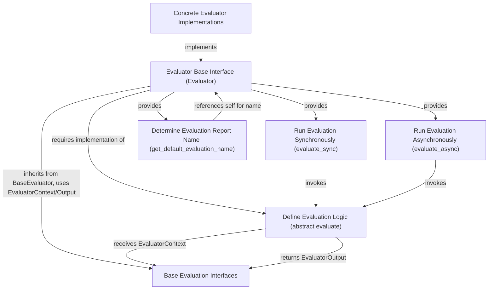

The `evaluator_interface` module provides the foundational `Evaluator` abstract base class, which is central to defining and executing evaluation logic within the `pydantic_evals_framework`. This module establishes a consistent interface for assessing task performance, allowing for both synchronous and asynchronous evaluation implementations. By standardizing the evaluation process, `evaluator_interface` facilitates the creation of diverse and robust evaluation metrics across various tasks.

### Core Functionality and Purpose

The `Evaluator` class is designed to be subclassed, requiring implementers to provide a concrete `evaluate` method. This method takes an `EvaluatorContext` object, encapsulating all necessary inputs, outputs, and metadata relevant to the evaluation. The flexibility to implement `evaluate` as either a synchronous or asynchronous function ensures broad compatibility with different execution environments and task types.

Key functionalities include:
- **Abstract Evaluation Definition**: The `evaluate` method serves as the core logic where subclasses define how a task's output is assessed against its expected behavior or criteria.
- **Synchronous and Asynchronous Execution**: `evaluate_sync` and `evaluate_async` methods provide standardized ways to run the evaluation logic, abstracting away the underlying synchronous or asynchronous nature of the `evaluate` implementation.
- **Evaluation Naming**: The `get_default_evaluation_name` method offers a flexible mechanism for evaluators to define how their results are named in reports, either through a specific attribute or by defaulting to the class name.

### Architecture and Relationships

The `evaluator_interface` module sits within the `pydantic_evals_framework`, specifically under `evaluation_base_classes`. It builds upon the `base_evaluator_interfaces` module, inheriting fundamental properties and types like `BaseEvaluator`, `EvaluatorContext`, and `EvaluatorOutput`. This hierarchical structure ensures a coherent and extensible evaluation system. Concrete evaluators throughout the framework (e.g., in `standard_evaluators` or `metric_evaluators`) will implement this `Evaluator` interface, providing specific logic for various evaluation tasks.

<!-- DIAGRAM_JSON
{
    "direction": "TD",
    "nodes": [
        {"id": "evaluator_base", "label": "Evaluator Base Interface (Evaluator)", "type": "component", "link": null},
        {"id": "evaluate_abstract", "label": "Define Evaluation Logic (abstract evaluate)", "type": "component", "link": null},
        {"id": "sync_runner", "label": "Run Evaluation Synchronously (evaluate_sync)", "type": "component", "link": null},
        {"id": "async_runner", "label": "Run Evaluation Asynchronously (evaluate_async)", "type": "component", "link": null},
        {"id": "naming_logic", "label": "Determine Evaluation Report Name (get_default_evaluation_name)", "type": "component", "link": null},
        {"id": "base_evaluator_interfaces", "label": "Base Evaluation Interfaces", "type": "external", "link": "base_evaluator_interfaces.md"},
        {"id": "concrete_eval_impl", "label": "Concrete Evaluator Implementations", "type": "external", "link": "evaluation_base_classes.md"}
    ],
    "edges": [
        {"source": "evaluator_base", "target": "base_evaluator_interfaces", "label": "inherits from BaseEvaluator, uses EvaluatorContext/Output"},
        {"source": "evaluator_base", "target": "evaluate_abstract", "label": "requires implementation of"},
        {"source": "evaluator_base", "target": "sync_runner", "label": "provides"},
        {"source": "evaluator_base", "target": "async_runner", "label": "provides"},
        {"source": "evaluator_base", "target": "naming_logic", "label": "provides"},
        {"source": "sync_runner", "target": "evaluate_abstract", "label": "invokes"},
        {"source": "async_runner", "target": "evaluate_abstract", "label": "invokes"},
        {"source": "evaluate_abstract", "target": "base_evaluator_interfaces", "label": "receives EvaluatorContext"},
        {"source": "evaluate_abstract", "target": "base_evaluator_interfaces", "label": "returns EvaluatorOutput"},
        {"source": "naming_logic", "target": "evaluator_base", "label": "references self for name"},
        {"source": "concrete_eval_impl", "target": "evaluator_base", "label": "implements"}
    ],
    "groups": []
}
-->

### Connection to Other Modules

- **[base_evaluator_interfaces](base_evaluator_interfaces.md)**: The `evaluator_interface` directly depends on this module for base classes and type definitions such as `BaseEvaluator`, `EvaluatorContext`, and `EvaluatorOutput`. These types form the fundamental contract for all evaluations.
- **[evaluation_base_classes](evaluation_base_classes.md)**: As a sibling module, `base_evaluator` likely provides a default or minimal implementation of an evaluator, demonstrating how to extend `Evaluator`.
- **[standard_evaluators](standard_evaluators.md)** and **[metric_evaluators](metric_evaluators.md)**: These modules will contain concrete implementations of the `Evaluator` interface, providing various pre-built evaluation metrics and functionalities.
- **`pydantic_evals_framework`**: The `evaluator_interface` is a core component of this larger framework, enabling consistent evaluation across all tasks managed by the framework.