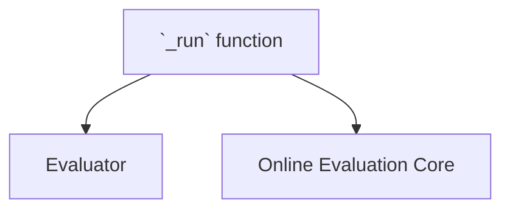

# `evaluator_runner` Module Documentation

The `evaluator_runner` module is a crucial component within the `pydantic_evals` framework, specifically designed to asynchronously execute individual evaluators as part of a larger online evaluation process. It encapsulates the core logic for running a single evaluation task and storing its results.

### Purpose and Core Functionality

The primary purpose of the `evaluator_runner` module is to provide an isolated and asynchronous mechanism for executing a given `Evaluator` instance. Its core functionality revolves around the `_run` asynchronous function, which takes an evaluator and a context, executes the evaluator using a helper function, and then stores the returned results. This ensures that each evaluation task can be processed independently and efficiently within the online evaluation system.

### Architecture and Component Relationships

The `evaluator_runner` module is a leaf module within the `online_evaluation_core`. Its main component, the `_run` function, is an integral part of the `pydantic_evals.pydantic_evals.online` package.

The `_run` function's execution flow involves:
1.  Receiving an `idx` (index for result storage) and an `evaluator` object (an instance of `Evaluator`).
2.  Utilizing an internal function, `run_evaluator`, to perform the actual evaluation logic. This `run_evaluator` function is part of the broader `online_evaluation_core` context and handles the specifics of invoking the provided `Evaluator` with the given `context`.
3.  Storing the results returned by `run_evaluator` into a `results_by_index` dictionary, which is part of the `online_evaluation_core`'s state.

This module acts as an execution engine for individual evaluation steps, abstracting away the asynchronous execution details from the higher-level evaluation orchestrators.

<!-- DIAGRAM_JSON
{
    "direction": "TD",
    "nodes": [
        {"id": "evaluator_runner_run", "label": "`_run` function", "type": "component", "link": null},
        {"id": "evaluator_class", "label": "Evaluator", "type": "external", "link": "pydantic_evals_evaluators.md"},
        {"id": "online_evaluation_core_module", "label": "Online Evaluation Core", "type": "external", "link": "online_evaluation_core.md"}
    ],
    "edges": [
        {"source": "evaluator_runner_run", "target": "evaluator_class"},
        {"source": "evaluator_runner_run", "target": "online_evaluation_core_module"}
    ],
    "groups": []
}
-->

### Integration with the Overall System

The `evaluator_runner` module, through its `_run` function, is a fundamental building block within the [online_evaluation_core](online_evaluation_core.md). It is called by higher-level orchestration logic (such as the `_run` function in `online_evaluation_core` itself or potentially the [evaluation_wrapper](evaluation_wrapper.md)) to execute specific evaluation tasks.

It depends on the [pydantic_evals_evaluators](pydantic_evals_evaluators.md) module to obtain `Evaluator` instances, which contain the actual evaluation logic. The results produced by `evaluator_runner` are then collected and managed by the [online_evaluation_core](online_evaluation_core.md), contributing to the overall evaluation report generation. This clear separation of concerns allows for flexible and scalable evaluation processes.
