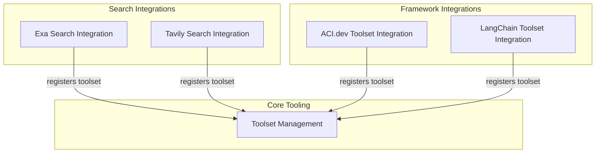

# External Toolset Integrations

This module serves as the primary integration point for various external toolsets, allowing the system to extend its capabilities by leveraging specialized functionalities from third-party services and frameworks. It provides standardized wrappers and mechanisms to incorporate tools like advanced search engines (Exa, Tavily), and tools from AI development platforms (ACI.dev, LangChain), enabling agents to interact with a wider range of resources and execute complex tasks.

## Architecture Overview

The `external_toolset_integrations` module is structured to provide flexible and efficient connections to external services. It defines distinct toolset wrappers for each integrated platform, ensuring that external tools can be seamlessly exposed and utilized by the core agent system. These wrappers abstract away the complexities of interacting with external APIs, presenting a unified interface to the agents.

<!-- DIAGRAM_JSON
{
    "direction": "TD",
    "nodes": [
        {"id": "exa_integration", "label": "Exa Search Integration", "type": "module", "link": "exa_integration.md"},
        {"id": "tavily_integration", "label": "Tavily Search Integration", "type": "module", "link": "tavily_integration.md"},
        {"id": "aci_toolset", "label": "ACI.dev Toolset Integration", "type": "module", "link": "aci_toolset.md"},
        {"id": "langchain_toolset", "label": "LangChain Toolset Integration", "type": "module", "link": "langchain_toolset.md"},
        {"id": "toolset_management", "label": "Toolset Management", "type": "module", "link": "toolset_management.md"}
    ],
    "edges": [
        {"source": "exa_integration", "target": "toolset_management", "label": "registers toolset"},
        {"source": "tavily_integration", "target": "toolset_management", "label": "registers toolset"},
        {"source": "aci_toolset", "target": "toolset_management", "label": "registers toolset"},
        {"source": "langchain_toolset", "target": "toolset_management", "label": "registers toolset"}
    ],
    "groups": [
        {
            "id": "search_providers",
            "label": "Search Integrations",
            "role": "data",
            "nodes": ["exa_integration", "tavily_integration"]
        },
        {
            "id": "framework_integrations",
            "label": "Framework Integrations",
            "role": "generative",
            "nodes": ["aci_toolset", "langchain_toolset"]
        },
        {
            "id": "core_tooling",
            "label": "Core Tooling",
            "role": "generative",
            "nodes": ["toolset_management"]
        }
    ]
}
-->

## Sub-modules

This module is composed of the following sub-modules, each handling a specific external toolset integration:

*   [Exa Search Integration](exa_integration.md): Handles integration with the Exa search engine.
*   [Tavily Search Integration](tavily_integration.md): Provides tools for searching the web using Tavily.
*   [ACI.dev Toolset Integration](aci_toolset.md): Manages the integration of tools from ACI.dev.
*   [LangChain Toolset Integration](langchain_toolset.md): Enables the use of tools defined within the LangChain framework.

## Relationships to Other Modules

This module primarily interacts with the [toolset_management](toolset_management.md) module, which is responsible for registering and making these external toolsets available to the wider system, including various agent definitions and execution graphs. The integrated toolsets, once registered, can be utilized by agents defined in modules like `agent_definition` and executed within the `agent_execution_graph`.