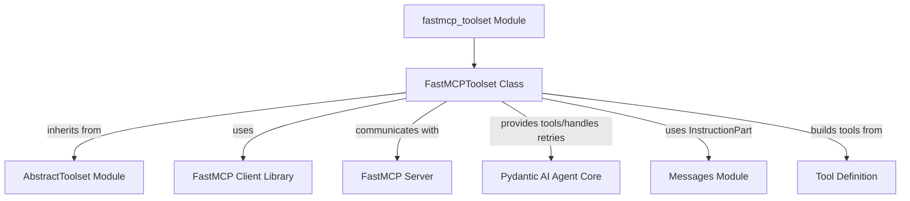

# fastmcp_toolset Module Documentation

## Introduction

The `fastmcp_toolset` module provides the `FastMCPToolset` class, enabling seamless integration with FastMCP (Multi-Capability Platform) servers. This module allows Pydantic AI agents to discover and execute tools hosted on local or remote FastMCP servers, significantly extending their capabilities.

## Architecture and Component Relationships

The `FastMCPToolset` acts as a bridge between the Pydantic AI agent framework and external FastMCP servers. It is built upon the `AbstractToolset` from the [toolset_architecture module](toolset_architecture.md), adhering to the standard toolset interface.

### Core Functionality

- **Client Management**: Manages the lifecycle of a FastMCP client connection, ensuring proper initialization and shutdown.
- **Tool Discovery**: Connects to a FastMCP server to retrieve a list of available tools, including their descriptions and input/output schemas.
- **Tool Execution**: Facilitates the execution of remote tools on the FastMCP server, handling arguments and processing results.
- **Error Handling**: Implements a configurable error handling mechanism for tool execution failures, allowing for model retries or immediate error propagation.
- **Server Instructions**: Optionally includes instructions provided by the FastMCP server directly into the agent's operational context.

### Diagram

<!-- DIAGRAM_JSON
{
    "direction": "TD",
    "nodes": [
        {"id": "fastmcp_toolset_module", "label": "fastmcp_toolset Module", "type": "component", "link": null},
        {"id": "fastmcp_toolset_class", "label": "FastMCPToolset Class", "type": "component", "link": null},
        {"id": "abstract_toolset_module", "label": "AbstractToolset Module", "type": "external", "link": "abstract_toolset.md"},
        {"id": "fastmcp_client_library", "label": "FastMCP Client Library", "type": "external", "link": "https://gofastmcp.com/"},
        {"id": "fastmcp_mcp_server", "label": "FastMCP Server", "type": "external", "link": "https://gofastmcp.com/"},
        {"id": "pydantic_ai_agent_core_module", "label": "Pydantic AI Agent Core", "type": "external", "link": "pydantic_ai_agent_core.md"},
        {"id": "messages_module", "label": "Messages Module", "type": "external", "link": "pydantic_ai_agent_core.md"},
        {"id": "tool_definition_entity", "label": "Tool Definition", "type": "external", "link": "toolset_architecture.md"}
    ],
    "edges": [
        {"source": "fastmcp_toolset_module", "target": "fastmcp_toolset_class"},
        {"source": "fastmcp_toolset_class", "target": "abstract_toolset_module", "label": "inherits from"},
        {"source": "fastmcp_toolset_class", "target": "fastmcp_client_library", "label": "uses"},
        {"source": "fastmcp_toolset_class", "target": "fastmcp_mcp_server", "label": "communicates with"},
        {"source": "fastmcp_toolset_class", "target": "pydantic_ai_agent_core_module", "label": "provides tools/handles retries"},
        {"source": "fastmcp_toolset_class", "target": "messages_module", "label": "uses InstructionPart"},
        {"source": "fastmcp_toolset_class", "target": "tool_definition_entity", "label": "builds tools from"}
    ],
    "groups": []
}
-->

## Integration with the Overall System

The `fastmcp_toolset` module is a vital component within the larger `pydantic_ai_tools` ecosystem, specifically under `toolset_architecture`. It enables the Pydantic AI framework to dynamically integrate and utilize external capabilities exposed by FastMCP servers. This integration allows agents defined within the [agent_definition module](agent_definition.md) to access a broader range of tools without requiring direct implementation within the Pydantic AI core.

By leveraging the `FastMCPToolset`, agents can:

- **Expand Tool Repertoire**: Access specialized tools hosted on various FastMCP servers.
- **Decouple Tool Implementations**: Keep tool logic separate from agent logic, promoting modularity and scalability.
- **Support Distributed Tooling**: Utilize tools across different services or machines via FastMCP's client-server architecture.

Errors encountered during tool execution, such as `ToolError` from the FastMCP server, are intelligently handled. Depending on the `tool_error_behavior` configuration, these errors can trigger a `ModelRetry` (a signal within the [pydantic_ai_agent_core module](pydantic_ai_agent_core.md) for the agent to potentially re-attempt the action or choose an alternative strategy) or be propagated as standard exceptions.

The `FastMCPToolset` contributes to the `pydantic_ai_core`'s extensibility, allowing it to adapt to diverse operational environments and integrate with various external systems through the FastMCP protocol.