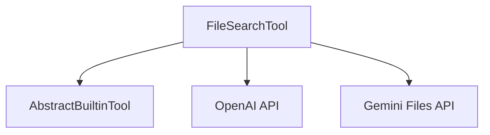

# File Search Tool

The `file_search_tool` module provides the `FileSearchTool`, a powerful built-in capability that allows AI agents to perform intelligent, vector-based searches across uploaded files. It offers a fully managed Retrieval-Augmented Generation (RAG) system, abstracting away the complexities of file storage, chunking, embedding generation, and contextual injection into prompts. This tool is designed to enhance agent capabilities by enabling them to retrieve relevant information directly from a corpus of documents.

## Core Functionality

The primary component of this module is `FileSearchTool`:

### `FileSearchTool`

```python
class FileSearchTool(AbstractBuiltinTool):
    """A builtin tool that allows your agent to search through uploaded files using vector search.

    This tool provides a fully managed Retrieval-Augmented Generation (RAG) system that handles
    file storage, chunking, embedding generation, and context injection into prompts.

    Supported by:

    * OpenAI Responses
    * Google (Gemini)
    """

    file_store_ids: Sequence[str]
    """The file store IDs to search through.

    For OpenAI, these are the IDs of vector stores created via the OpenAI API.
    For Google, these are file search store names that have been uploaded and processed via the Gemini Files API.
    """

    kind: str = 'file_search'
    """The kind of tool."""
```

`FileSearchTool` is a concrete implementation of an [AbstractBuiltinTool](builtin_tools.md). It facilitates file-based information retrieval for AI agents. Key features include:

-   **Vector Search**: Leverages vector embeddings to perform semantic searches, providing more relevant results than keyword-based searches.
-   **Managed RAG System**: Automatically handles the entire RAG pipeline, from ingestion to retrieval, without requiring manual intervention from the agent developer.
-   **Multi-Platform Support**: Compatible with both OpenAI and Google (Gemini) platforms, allowing for flexible deployment and integration.
-   **Configurable File Stores**: Agents can be configured with specific `file_store_ids` to define which document collections they can access.

## Architecture and Component Relationships

<!-- DIAGRAM_JSON
{
    "direction": "TD",
    "nodes": [
        {"id": "file_search_tool", "label": "FileSearchTool", "type": "component", "link": null},
        {"id": "abstract_builtin_tool", "label": "AbstractBuiltinTool", "type": "external", "link": "builtin_tools.md"},
        {"id": "openai_api", "label": "OpenAI API", "type": "external", "link": null},
        {"id": "gemini_files_api", "label": "Gemini Files API", "type": "external", "link": null}
    ],
    "edges": [
        {"source": "file_search_tool", "target": "abstract_builtin_tool"},
        {"source": "file_search_tool", "target": "openai_api"},
        {"source": "file_search_tool", "target": "gemini_files_api"}
    ],
    "groups": []
}
-->


-   **`FileSearchTool`**: The central component of this module, responsible for orchestrating file search operations.
-   **[AbstractBuiltinTool](builtin_tools.md)**: `FileSearchTool` extends this abstract class, inheriting common functionalities and adhering to the interface defined for all built-in tools within the system. This ensures consistency and interoperability with other tools.
-   **OpenAI API**: An external dependency for agents configured to use OpenAI's vector stores for file search.
-   **Gemini Files API**: An external dependency for agents configured to use Google's Gemini Files API for file search.

## How the Module Fits into the Overall System

The `file_search_tool` module is a vital part of the [pydantic_ai_tools](pydantic_ai_tools.md) ecosystem, specifically categorized under [builtin_tools](builtin_tools.md). It empowers AI agents, defined within the [pydantic_ai_agent_core](pydantic_ai_agent_core.md) module, with the ability to retrieve and utilize information from extensive document repositories. By integrating this tool, agents can perform more informed decision-making and generate more accurate responses by referencing external knowledge bases. Its managed RAG system simplifies the development of agents requiring document interaction, making it a cornerstone for knowledge-intensive AI applications.
